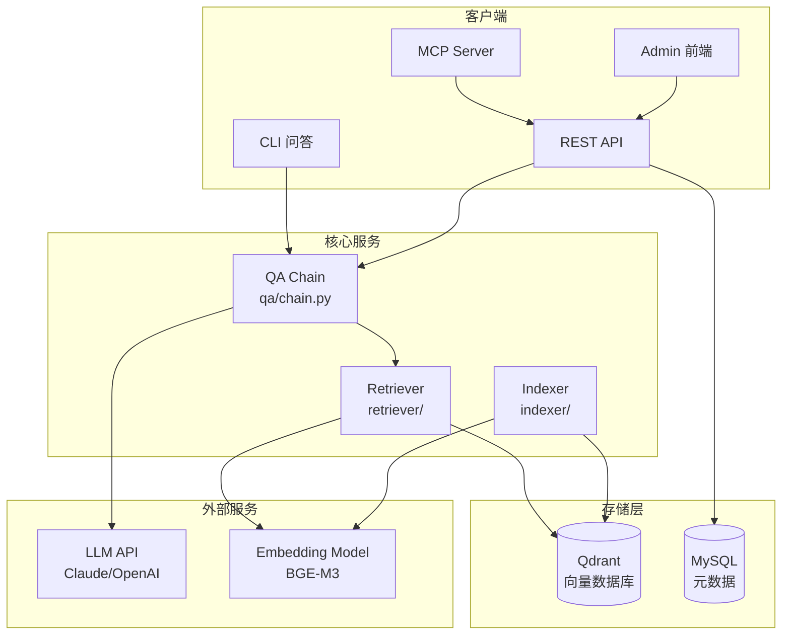
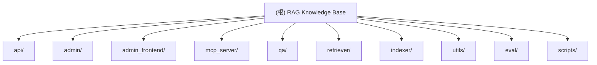

# RAG Knowledge Base System

> 基于 Claude 3.5 Haiku 的个人知识库检索增强生成系统
>
> **最后更新**: 2025-12-08 23:26:20

## 变更记录 (Changelog)

### 2025-12-11 13:30:00
- **代码优化**: 删除未使用的 knowledge_graph/ 和 multimodal/ 模块
- **工具优化**: 移除 utils/db_manager.py 和 utils/vector_optimizer.py
- **Agent 模块**: 已启用并集成到 API 服务 (POST /agent)
- **新增工具**: utils/error_handler.py, utils/config_manager.py
- **文档更新**: 新增 AGENT_USAGE.md 使用指南

### 2025-12-08 23:26:20
- 完成项目架构文档全量初始化
- 已生成所有模块的 CLAUDE.md 文档
- 新增 Mermaid 结构图和导航面包屑
- 统计覆盖率: 10个核心模块已全部文档化

### 2025-12-08 23:06:35
- 完成架构文档初始化
- 新增模块结构图和导航系统
- 完善各模块的 CLAUDE.md 文档

## 项目愿景

RAG-MCP 是一个企业级个人/项目知识库系统，旨在提供：
- 多源数据索引能力（代码库、Markdown、PDF、知识笔记）
- 智能混合检索（向量检索 + 关键词检索 + Reranker 重排）
- 上下文感知问答（基于 Claude Haiku 的智能对话）
- **ReAct Agent** (多步推理 + 工具调用)
- Claude Desktop 集成（通过 MCP Server 无缝接入）
- 可视化后台管理（LLM 供应商/模型管理、知识库管理、使用统计）
- **嵌入模型热重载**（后台切换供应商无需重启服务）

## 技术栈

| 类别 | 技术 |
|------|------|
| 嵌入模型 | BGE-M3 (BAAI/bge-m3) |
| 重排模型 | BGE-Reranker (BAAI/bge-reranker-base) |
| 向量数据库 | Qdrant |
| 编排框架 | LangChain |
| 大模型 | Claude 3.5 Haiku / OpenAI 兼容 API |
| Web框架 | FastAPI + Uvicorn |
| 前端 | React 19 + Vite + Ant Design + TailwindCSS |
| 数据库 | MySQL (元数据) + Qdrant (向量) |
| 认证 | JWT (python-jose) |

## 架构总览



## 模块结构图



## 模块索引

| 模块 | 路径 | 职责 | 入口文件 |
|------|------|------|----------|
| [API 服务](./api/CLAUDE.md) | `api/` | FastAPI REST API 服务 | `server.py` |
| [后台管理](./admin/CLAUDE.md) | `admin/` | 后台管理 API 路由、认证、数据模型 | `routes.py` |
| [前端管理](./admin_frontend/CLAUDE.md) | `admin_frontend/` | React 管理后台前端 | `src/App.jsx` |
| [MCP Server](./mcp_server/CLAUDE.md) | `mcp_server/` | Claude Desktop MCP 集成 | `server.py` |
| [问答模块](./qa/CLAUDE.md) | `qa/` | QA Chain 和 CLI 交互 | `chain.py`, `cli.py` |
| [检索模块](./retriever/CLAUDE.md) | `retriever/` | 向量检索、混合检索、重排 | `hybrid_search.py` |
| [索引模块](./indexer/CLAUDE.md) | `indexer/` | 代码/文档索引和切分 | `index_all.py` |
| [工具模块](./utils/CLAUDE.md) | `utils/` | 嵌入模型、LLM客户端、日志 | `embeddings.py`, `llm.py` |
| [评估模块](./eval/CLAUDE.md) | `eval/` | 检索质量评估 | `evaluator.py` |
| [部署脚本](./scripts/CLAUDE.md) | `scripts/` | 部署和启动脚本 | `deploy.sh` |

## 运行与开发

### 快速开始

```bash
# 1. 安装依赖
pip install -r requirements.txt

# 2. 配置环境变量
cp .env.example .env
# 编辑 .env 填写 ANTHROPIC_API_KEY 等

# 3. 启动 Qdrant
docker run -p 6333:6333 qdrant/qdrant

# 4. 启动 API 服务
uvicorn api.server:app --host 0.0.0.0 --port 8000

# 5. 访问后台管理
# http://localhost:8000/admin
```

### 环境变量

| 变量 | 说明 | 默认值 |
|------|------|--------|
| `LLM_PROVIDER` | LLM 提供商 (anthropic/openai) | `anthropic` |
| `LLM_MODEL` | 模型名称 | `claude-3-5-haiku-20241022` |
| `ANTHROPIC_API_KEY` | Anthropic API Key | - |
| `ANTHROPIC_API_BASE` | 自定义 API 地址 | 官方地址 |
| `QDRANT_HOST` | Qdrant 地址 | `localhost` |
| `QDRANT_PORT` | Qdrant 端口 | `6333` |
| `QDRANT_API_KEY` | Qdrant 认证密钥 | - |
| `EMBEDDING_MODEL` | 嵌入模型 | `BAAI/bge-m3` |
| `RERANKER_ENABLE` | 启用重排 | `1` |

### 本地开发

```bash
# 启动 API 服务（开发模式）
./scripts/start_api.sh

# 启动前端开发服务器
cd admin_frontend
npm install
npm run dev

# 索引项目
./scripts/index_project.sh
```

### API 端点

#### 公开端点
- `GET /health` - 健康检查
- `GET /` - 重定向到后台

#### 认证端点 (需登录)
- `POST /query` - RAG 问答
- `POST /search` - 向量检索
- `POST /add_knowledge` - 添加知识
- `POST /clear-history` - 清空对话历史

#### 后台管理 API (`/admin/api/`)
- `POST /auth/login` - 登录
- `GET /auth/me` - 当前用户
- `GET /stats` - 统计数据
- `GET/POST/PUT/DELETE /providers` - 供应商管理
- `GET/POST/PUT/DELETE /models` - 模型管理
- `GET/PUT/DELETE /knowledge` - 知识管理
- `GET /usage/logs` - 使用日志
- `GET /usage/stats` - 使用统计
- `POST /models/test` - 测试模型

## 测试策略

### 单元测试
- 使用 `pytest` 进行单元测试
- 测试覆盖核心模块：检索、索引、问答

### 集成测试
- API 端点测试
- 数据库连接测试
- Qdrant 向量检索测试

### 测试命令
```bash
# 运行所有测试
pytest

# 测试 API 健康检查
curl http://localhost:8000/health

# 测试 RAG 问答
curl -X POST http://localhost:8000/query \
  -H "Content-Type: application/json" \
  -d '{"question": "这个项目的主要功能是什么？"}'
```

## 编码规范

### Python 代码风格
- Python 3.10+，强制使用类型注解
- 使用 Pydantic 进行数据验证
- FastAPI 路由使用 `async`/`await`
- 日志统一使用 `utils.logger`
- 文档字符串遵循 Google 风格

### 前端代码风格
- React 19 + 函数式组件
- 使用 Ant Design 组件库
- 状态管理使用 React Hooks
- API 调用统一使用 `services/api.js`

### 提交规范
- `feat`: 新功能
- `fix`: 修复
- `docs`: 文档
- `refactor`: 重构
- `test`: 测试
- `chore`: 构建/工具

## AI 使用指引

### 与 Claude 协作的最佳实践

1. **查找代码和功能定位**
   - 优先使用 codex MCP 进行代码搜索和定位
   - 在修改代码前，先了解模块间的依赖关系

2. **模块修改策略**
   - 简单任务（文档、注释、查询）：直接完成
   - 中等任务（功能增强、Bug 修复）：与 codex 协作
   - 复杂任务（架构变更、新模块）：深度 codex 协作

3. **代码质量保证**
   - 所有生产代码必须包含类型注解
   - 添加必要的错误处理
   - 编写清晰的注释和文档
   - 遵循项目现有的代码风格

4. **问答系统使用**
   - 使用 MCP Server 直接在 Claude Desktop 中查询知识库
   - 使用 CLI 模式进行交互式问答
   - 通过 API 集成到其他工具

## 部署规范

### ⚠️ 重要部署规则

**AI 助手必读:** 每次代码更新后,必须按照以下流程部署,严禁手动 SSH 操作!

#### 部署服务器信息
- **服务器**: ljf@34.180.100.55
- **项目目录**: ~/rag
- **API地址**: https://rag.litxczv.shop
- **管理后台**: https://rag.litxczv.shop/admin

### 🚀 标准部署流程(自动化)

**每次代码更新后,使用以下命令:**

```bash
./scripts/quick-deploy-new.sh "你的提交信息"
```

**该脚本会自动完成:**
1. ✅ 提交本地更改到 Git
2. ✅ 推送到 GitHub
3. ✅ SSH 登录服务器
4. ✅ 拉取最新代码
5. ✅ 优雅重启服务(零端口冲突)
6. ✅ 健康检查验证

**示例:**
```bash
# 功能更新
./scripts/quick-deploy-new.sh "feat: 添加用户认证功能"

# Bug 修复
./scripts/quick-deploy-new.sh "fix: 修复向量检索错误"

# 不指定消息(使用默认)
./scripts/quick-deploy-new.sh
```

### 🛠️ 仅重启服务(无代码更改)

如果只需要重启服务(例如配置变更):

```bash
ssh ljf@34.180.100.55 "cd ~/rag && bash scripts/graceful-restart.sh"
```

### ⚙️ 优雅重启机制

`graceful-restart.sh` 脚本彻底解决了端口冲突问题:

1. **优雅关闭**: 发送 SIGTERM 信号,等待最多30秒
2. **强制清理**: 如未退出,使用 kill -9
3. **端口确认**: 确保端口 8000 完全释放
4. **启动服务**: 启动新的 uvicorn 进程
5. **健康检查**: 自动验证服务状态
6. **日志输出**: 显示启动日志和错误信息

### 🚫 禁止的部署方式

**以下方式会导致端口冲突和500错误:**

```bash
# ❌ 错误示例 1: 直接 pkill + 立即启动
pkill -f uvicorn
uvicorn api.server:app ...  # 端口可能还未释放!

# ❌ 错误示例 2: sleep 时间不够
pkill -f uvicorn
sleep 2  # 不够!进程可能还在退出
uvicorn api.server:app ...

# ❌ 错误示例 3: 手动 SSH 操作
ssh ljf@34.180.100.55
git pull
pkill uvicorn
nohup uvicorn ...  # 容易出错!
```

### 📊 部署状态检查

```bash
# 检查服务状态
curl https://rag.litxczv.shop/health

# 查看服务进程
ssh ljf@34.180.100.55 "ps aux | grep uvicorn"

# 查看最近日志
ssh ljf@34.180.100.55 "tail -50 ~/rag/server.log"
```

### 🔧 故障排查

#### 问题1: 部署后 500 错误

**原因**: 端口冲突或服务启动失败

**排查步骤:**
```bash
# 1. 查看日志
ssh ljf@34.180.100.55 "tail -100 ~/rag/server.log"

# 2. 强制重启
ssh ljf@34.180.100.55 "pkill -9 -f uvicorn; cd ~/rag && bash scripts/graceful-restart.sh"

# 3. 检查端口占用
ssh ljf@34.180.100.55 "netstat -tlnp | grep :8000"
```

#### 问题2: 配置未生效

**原因**: 服务启动时会缓存数据库配置

**解决**: 重启服务即可
```bash
ssh ljf@34.180.100.55 "cd ~/rag && bash scripts/graceful-restart.sh"
```

#### 问题3: 健康检查失败

**排查顺序:**
1. 检查 Qdrant 是否运行
2. 检查 MySQL 连接
3. 检查环境变量配置
4. 查看完整错误日志

### 📝 部署 Checklist

每次部署前确认:

- [ ] 代码已在本地测试通过
- [ ] 没有敏感信息(API Key 等)硬编码
- [ ] 数据库迁移已执行(如有)
- [ ] 环境变量配置正确
- [ ] 使用 `quick-deploy-new.sh` 脚本部署
- [ ] 部署后进行健康检查
- [ ] 验证核心功能正常

### 🎯 AI 助手部署规则

**当用户说"部署"、"更新服务器"、"上线"等关键词时:**

1. **首选方案**: 使用 `./scripts/quick-deploy-new.sh`
2. **提交信息**: 根据本次修改内容生成有意义的 commit message
3. **自动验证**: 脚本会自动进行健康检查
4. **失败处理**: 如果部署失败,自动查看日志并报告错误

**禁止直接执行:**
- 禁止手动 SSH + git pull + 手动重启
- 禁止使用 `pkill -9` 而不确认端口释放
- 禁止跳过健康检查

### 本地开发
```bash
./scripts/start_api.sh
```

### Docker 部署(可选)
```bash
# 启动 Qdrant
docker run -d -p 6333:6333 qdrant/qdrant

# 构建并运行 RAG API
docker build -t rag-api .
docker run -d -p 8000:8000 --env-file .env rag-api
```

## 相关文档

- [快速开始指南](./QUICK_START.md)
- [安装指南](./SETUP_GUIDE.md)
- [后台管理说明](./ADMIN_README.md)
- [前端开发说明](./admin_frontend/README.md)
- [Reranker 集成计划](./.claude/plan/reranker-integration.md)
- [MCP Server 计划](./.claude/plan/mcp-server.md)
- [后台系统计划](./.claude/plan/admin-system.md)

## 常见问题 (FAQ)

### 如何切换 LLM 提供商？
编辑 `.env` 文件，设置 `LLM_PROVIDER=anthropic` 或 `LLM_PROVIDER=openai`，并配置相应的 API Key。

### 如何启用 Reranker？
在 `.env` 中设置 `RERANKER_ENABLE=1`，系统将使用 BGE-Reranker 对检索结果进行重排。

### 如何添加新的知识源？
使用 `indexer/index_all.py` 脚本，或通过 API 端点 `POST /add_knowledge` 动态添加。

### 如何自定义嵌入模型？
在 `.env` 中设置 `EMBEDDING_MODEL`，支持所有 sentence-transformers 兼容的模型。

### 如何查看系统日志？
```bash
# 查看 API 日志
./scripts/logs.sh

# 查看 Python 日志
tail -f logs/rag.log
```
