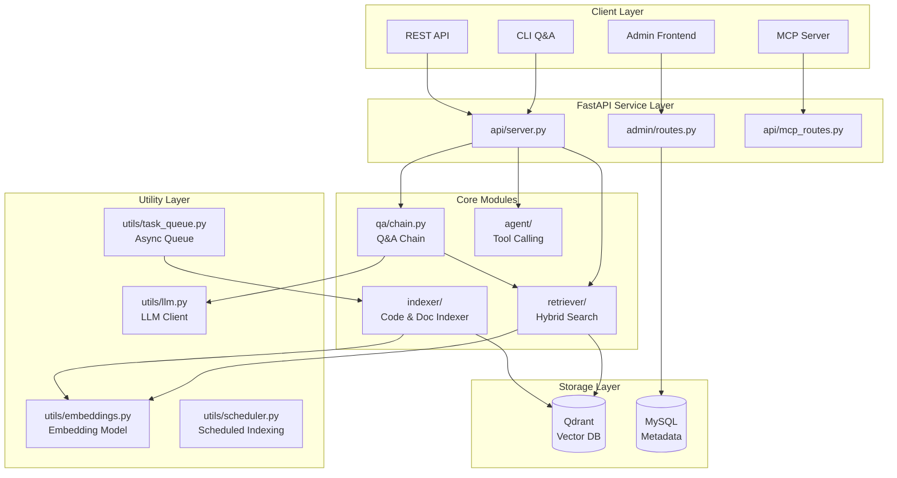

# RAG Knowledge Base System

> **Last Updated**: 2025-12-12 19:13:51
> **Project Type**: Python + React Full-Stack RAG System
> **License**: MIT

## Project Overview

Enterprise-grade personal knowledge base RAG system based on Claude/OpenAI, supporting multi-source data indexing, hybrid retrieval, async task queue, Agent tool invocation, and visual management dashboard.

### Core Features

- **Intelligent Retrieval**: Vector + BM25 hybrid search with optional BGE-Reranker
- **Multi-source Indexing**: Code, Markdown, PDF, Word documents with incremental updates
- **AI Q&A**: Context-aware conversation with memory compression and streaming response
- **Agent Framework**: Tool calling with ReAct reasoning pattern
- **Async Task Queue**: Non-blocking knowledge addition with 3 concurrent workers
- **MCP Integration**: Claude Desktop integration via Model Context Protocol

## Architecture Diagram



## Module Index

| Module | Path | Description |
|--------|------|-------------|
| **API Server** | [`api/`](api/CLAUDE.md) | FastAPI REST API service entry point |
| **Admin Backend** | [`admin/`](admin/CLAUDE.md) | Backend management routes, models, auth |
| **Admin Frontend** | [`admin_frontend/`](admin_frontend/CLAUDE.md) | React 19 + Ant Design dashboard |
| **Q&A Module** | [`qa/`](qa/CLAUDE.md) | Q&A chain with conversation memory |
| **Retriever** | [`retriever/`](retriever/CLAUDE.md) | Hybrid search, reranker, semantic cache |
| **Indexer** | [`indexer/`](indexer/CLAUDE.md) | Code & document indexing with chunking |
| **MCP Server** | [`mcp_server/`](mcp_server/CLAUDE.md) | Claude Desktop MCP integration |
| **Utilities** | [`utils/`](utils/CLAUDE.md) | LLM client, embeddings, task queue |
| **Evaluation** | [`eval/`](eval/CLAUDE.md) | Retrieval quality evaluation |
| **Scripts** | [`scripts/`](scripts/CLAUDE.md) | Deployment and management scripts |

## Tech Stack

| Category | Technology |
|----------|------------|
| **Backend** | FastAPI + Uvicorn + Gunicorn |
| **Vector DB** | Qdrant |
| **Embedding** | OpenAI API / Local BGE-M3 |
| **Reranker** | BGE-Reranker (optional) |
| **LLM** | Claude Haiku/Sonnet / OpenAI Compatible |
| **Framework** | LangChain |
| **Frontend** | React 19 + Vite + Ant Design + TailwindCSS |
| **Metadata** | MySQL |
| **Auth** | JWT (python-jose) |
| **Task Queue** | asyncio.Queue (in-memory) |

## Key Entry Points

| Entry | Path | Description |
|-------|------|-------------|
| API Server | `api/server.py` | Main FastAPI application |
| MCP Server | `mcp_server/server.py` | Claude Desktop integration |
| CLI Q&A | `qa/cli.py` | Command-line interactive Q&A |
| Indexer | `indexer/index_all.py` | Unified indexing entry |
| Config | `config.py` | Environment configuration |

## Quick Commands

```bash
# Start API server
uvicorn api.server:app --host 0.0.0.0 --port 8000

# Start with script
./scripts/start_api.sh

# Run indexer
python -m indexer.index_all --incremental

# Start frontend dev
cd admin_frontend && npm run dev

# Build frontend
cd admin_frontend && npm run build

# Deploy (commit + push + restart)
./scripts/quick-deploy-new.sh "feat: description"
```

## API Endpoints Overview

### Public
- `GET /health` - Health check
- `POST /mcp/verify` - MCP API key verification

### Authenticated (JWT/API Key)
- `POST /query` - RAG Q&A
- `POST /query/stream` - Streaming RAG Q&A
- `POST /search` - Vector search
- `POST /add_knowledge` - Add knowledge (async)
- `POST /agent` - Agent tool calling

### Admin API (`/admin/api/*`)
- Auth: login, refresh, me
- CRUD: providers, models, knowledge, groups, api-keys
- Stats: usage logs, statistics

## Environment Variables

Key configuration in `.env`:

```bash
# LLM
LLM_PROVIDER=anthropic|openai
LLM_MODEL=claude-3-5-haiku-20241022

# Qdrant
QDRANT_HOST=localhost
QDRANT_PORT=6333

# MySQL
MYSQL_HOST=localhost
MYSQL_DATABASE=rag_admin

# Embedding
EMBEDDING_PROVIDER=api|local
EMBEDDING_MODEL=text-embedding-3-small
EMBEDDING_DIM=1536

# Optional
RERANKER_ENABLE=0|1
SCHEDULER_ENABLE=0|1
```

## Code Conventions

- **Language**: Python 3.10+, TypeScript/JSX for frontend
- **Style**: PEP 8 for Python, ESLint for JS
- **Docstrings**: Chinese comments are acceptable, APIs should have English docstrings
- **Error Handling**: Use custom exceptions, log with `utils/logger.py`
- **Type Hints**: Required for function signatures

## Development Guidelines

1. **API Changes**: Update `admin/schemas.py` for Pydantic models
2. **New Routes**: Add to `admin/routes.py` or `api/server.py`
3. **New Tools**: Register in `agent/tools.py`
4. **New Indexer**: Create in `indexer/` following `code_indexer.py` pattern
5. **Frontend Pages**: Add to `admin_frontend/src/pages/`

## Testing

```bash
# Run evaluation
python -m eval.evaluator

# Test LLM connection (via admin API)
POST /admin/api/models/test
```

## File Statistics

- **Total Modules**: 10
- **Python Files**: ~40
- **React Components**: ~17 pages
- **Scripts**: 16

---

*This file is auto-generated. For module-specific details, see individual CLAUDE.md files in each directory.*
