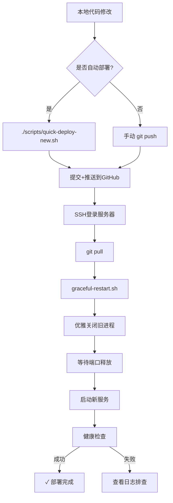

# RAG 项目部署指南

## 🚀 快速部署

### 方法一:自动部署(推荐)

每次更新代码后,直接运行:

```bash
./scripts/quick-deploy-new.sh "你的提交信息"
```

**流程说明:**
1. ✅ 自动提交本地更改
2. ✅ 推送到 GitHub
3. ✅ 服务器拉取最新代码
4. ✅ 优雅重启服务(零端口冲突)
5. ✅ 健康检查确认

### 方法二:手动部署

```bash
# 1. 提交代码
git add -A
git commit -m "你的提交信息"
git push

# 2. 登录服务器
ssh ljf@34.180.100.55

# 3. 拉取并重启
cd ~/rag
git pull
bash scripts/graceful-restart.sh
```

## ⚙️ 优雅重启原理

`graceful-restart.sh` 脚本解决了端口冲突问题:

```
1. 发送 SIGTERM 信号(优雅关闭)
2. 等待进程退出(最多30秒)
3. 如仍未退出,强制 kill -9
4. 确认端口完全释放
5. 启动新服务
6. 健康检查验证
```

## 🛠️ 仅重启服务

如果代码已经是最新,只需要重启:

```bash
ssh ljf@34.180.100.55 "cd ~/rag && bash scripts/graceful-restart.sh"
```

## 📊 服务管理

### 查看服务状态
```bash
ssh ljf@34.180.100.55 "ps aux | grep uvicorn"
```

### 查看日志
```bash
ssh ljf@34.180.100.55 "tail -50 ~/rag/server.log"
```

### 健康检查
```bash
curl https://rag.litxczv.shop/health
```

## ❌ 遇到问题?

### 问题1: 端口仍被占用

**症状**: 启动时报错 `Address already in use`

**解决**:
```bash
ssh ljf@34.180.100.55 "pkill -9 -f uvicorn; cd ~/rag && bash scripts/graceful-restart.sh"
```

### 问题2: 服务启动失败

**症状**: 健康检查失败

**排查**:
```bash
ssh ljf@34.180.100.55 "tail -100 ~/rag/server.log"
```

常见原因:
- 数据库连接失败
- Qdrant 未启动
- 环境变量配置错误
- Python 依赖缺失

### 问题3: 配置未生效

**原因**: 服务启动时会缓存数据库配置

**解决**: 重启服务
```bash
ssh ljf@34.180.100.55 "cd ~/rag && bash scripts/graceful-restart.sh"
```

## 📝 常用命令

```bash
# 快速部署
./scripts/quick-deploy-new.sh

# 查看远程日志
ssh ljf@34.180.100.55 "tail -f ~/rag/server.log"

# 强制重启
ssh ljf@34.180.100.55 "pkill -9 -f uvicorn; cd ~/rag && bash scripts/graceful-restart.sh"

# 检查服务
curl https://rag.litxczv.shop/health
```

## 🔄 部署流程图



## 🎯 最佳实践

1. **使用自动部署脚本**
   - 减少手动操作
   - 避免端口冲突
   - 自动健康检查

2. **重要更新前备份**
   ```bash
   ssh ljf@34.180.100.55 "cd ~/rag && git tag backup-$(date +%Y%m%d-%H%M%S)"
   ```

3. **监控服务日志**
   ```bash
   # 实时监控
   ssh ljf@34.180.100.55 "tail -f ~/rag/server.log"
   ```

4. **定期重启**
   - 避免内存泄漏
   - 刷新数据库连接
   - 建议每周重启一次

## 🔗 相关链接

- API 服务: https://rag.litxczv.shop
- 管理后台: https://rag.litxczv.shop/admin
- 服务器: ljf@34.180.100.55
- 项目目录: ~/rag
