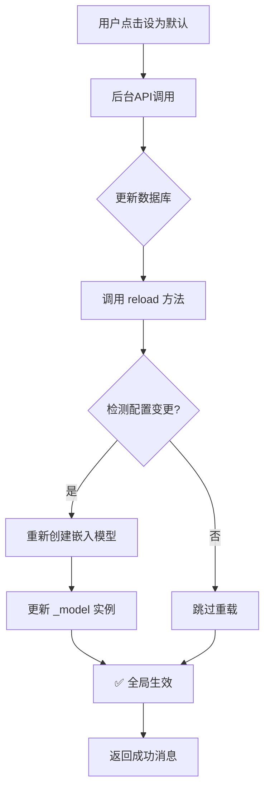

# 嵌入模型热重载功能

## 🎯 功能概述

现在后台管理可以动态切换嵌入模型供应商,**无需重启服务即可生效**!

## ✨ 工作原理

### 1. 热重载机制

**核心思想**: 使用单例模式 + 配置变更检测

```python
class EmbeddingModel:
    _instance = None
    _model = None
    _last_provider_id = None  # 记录上次使用的供应商ID

    def reload(self):
        """检测数据库配置是否变更,变更时重新加载模型"""
        db_config = self._get_default_embedding_from_db()
        new_provider_id = db_config['id'] if db_config else None

        if new_provider_id != self._last_provider_id:
            logger.info("检测到嵌入供应商变更,重新加载模型")
            self._model = self._create_model()
            return True
        return False
```

### 2. API 端点自动触发

当你在后台点击"设为默认"按钮时:

```http
POST /admin/api/embedding-providers/{provider_id}/set-default
```

**后台自动执行**:
1. ✅ 更新数据库默认标记
2. ✅ 调用 `embedding_model.reload()` 热重载
3. ✅ 返回成功消息

```python
# 设置默认供应商后自动触发热重载
provider.is_default = True
db.commit()

embedding_model = get_embedding_model()
reloaded = embedding_model.reload()
# 模型已切换,立即生效!
```

## 🚀 使用方法

### 方式1: 后台管理界面(推荐)

1. 登录后台管理: https://rag.litxczv.shop/admin
2. 进入"嵌入供应商管理"页面
3. 点击任意供应商的"设为默认"按钮
4. ✅ 看到提示"已将 'XXX' 设置为默认嵌入供应商,无需重启服务"
5. **立即生效**,无需任何其他操作!

### 方式2: API 调用

```bash
# 1. 登录获取 Token
TOKEN=$(curl -s -X POST "https://rag.litxczv.shop/admin/api/auth/login" \
  -H "Content-Type: application/json" \
  -d '{"username":"admin","password":"admin123"}' \
  | jq -r '.access_token')

# 2. 设置默认嵌入供应商(假设 ID=2)
curl -X POST "https://rag.litxczv.shop/admin/api/embedding-providers/2/set-default" \
  -H "Authorization: Bearer $TOKEN"

# 响应:
# {
#   "message": "已将 'Qwen3-Embedding' 设置为默认嵌入供应商,无需重启服务"
# }
```

## 🔍 验证方法

### 1. 查看日志验证

部署后查看服务日志:

```bash
ssh ljf@34.180.100.55 "tail -50 ~/rag/server.log | grep -i embedding"
```

**切换前**:
```
2025-12-11 使用数据库配置的嵌入模型: OpenAI-Embedding
2025-12-11 API 嵌入维度: 1536
```

**切换后**:
```
2025-12-11 检测到嵌入供应商变更,重新加载模型 (旧: 1, 新: 2)
2025-12-11 使用数据库配置的嵌入模型: Qwen3-Embedding
2025-12-11 API 嵌入维度: 8192
```

### 2. 测试嵌入功能

使用 RAG 系统添加知识:

```bash
curl -X POST "https://rag.litxczv.shop/add_knowledge" \
  -H "Content-Type: application/json" \
  -d '{
    "content": "测试热重载功能的知识条目",
    "title": "热重载测试"
  }'
```

**日志应该显示**:
```
2025-12-11 使用数据库配置的嵌入模型: Qwen3-Embedding  # 新模型
2025-12-11 成功添加知识到Qdrant: abc123...
```

## 📊 技术细节

### 单例模式保证全局唯一

```python
class EmbeddingModel:
    _instance = None

    def __new__(cls):
        if cls._instance is None:
            cls._instance = super().__new__(cls)
        return cls._instance
```

**好处**:
- ✅ 整个应用共享同一个嵌入模型实例
- ✅ 避免重复加载模型浪费内存
- ✅ 热重载时全局立即生效

### 供应商变更检测

```python
_last_provider_id = None  # 记录上次使用的供应商ID

def reload(self):
    new_provider_id = db_config['id'] if db_config else None

    # 只有ID变化时才重新加载
    if new_provider_id != self._last_provider_id:
        self._model = self._create_model()
        self._last_provider_id = new_provider_id
        return True
    return False
```

**优化**:
- ✅ 避免重复加载相同模型
- ✅ 通过 provider ID 精确判断变更
- ✅ 返回布尔值表示是否真正重载

## ⚠️ 注意事项

### 1. 环境变量降级

如果数据库中没有默认嵌入供应商,系统会降级使用环境变量配置:

```bash
# .env 文件
EMBEDDING_API_KEY=sk-xxx
EMBEDDING_API_BASE=https://api.openai.com
EMBEDDING_MODEL=text-embedding-3-small
```

**此时无法热重载**,需要重启服务。

### 2. 嵌入维度变更

切换不同维度的嵌入模型时,**已有的向量数据不会自动迁移**。

**示例**:
- 原模型: OpenAI Embedding (1536维)
- 新模型: Qwen3-Embedding (8192维)

**影响**:
- ❌ 旧知识无法用新模型检索(维度不匹配)
- ✅ 新添加的知识使用新模型嵌入

**解决方案**:
1. 使用相同维度的模型(推荐)
2. 或者重新索引所有知识库数据

### 3. 性能影响

**首次切换**:
- API 模型: 几乎无延迟 (~50ms)
- 本地模型: 需要下载和加载 (~5秒)

**后续使用**:
- 无额外开销,与重启服务效果相同

## 🎉 优势

### 与重启服务对比

| 维度 | 热重载 | 重启服务 |
|------|--------|----------|
| **生效时间** | 立即生效 | 30秒+ |
| **用户影响** | 无感知 | 短暂中断 |
| **操作复杂度** | 点一次按钮 | 手动SSH操作 |
| **错误风险** | 低 | 中(端口冲突) |
| **适用场景** | 所有情况 | 仅配置变更 |

### 典型使用场景

1. **A/B 测试不同嵌入模型**
   - 快速切换 OpenAI/Qwen3/BGE-M3
   - 对比检索效果

2. **成本优化**
   - 工作时间用高精度模型
   - 非工作时间用低成本模型

3. **紧急切换**
   - API 限流/故障时快速切换备用供应商
   - 无需重启避免服务中断

## 🔄 工作流程图



## 📝 后续改进计划

- [ ] 支持自动化A/B测试
- [ ] 添加模型性能监控
- [ ] 嵌入维度自动适配
- [ ] 多版本向量并存
- [ ] 历史配置回滚功能

---

**文档更新时间**: 2025-12-11
**功能版本**: v1.0.0
