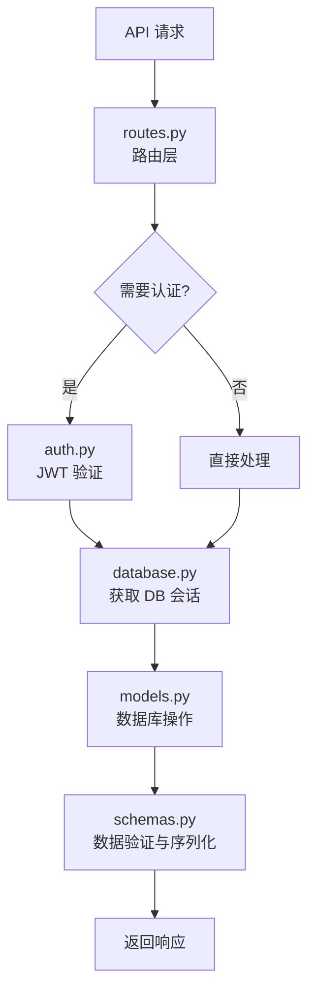

# 后台管理模块

**导航**: [← 返回根目录](../CLAUDE.md) / **admin/**

> 后台管理系统 API 路由、认证、数据模型
>
> **最后更新**: 2025-12-08 23:06:35

## 模块概述

`admin/` 模块提供完整的后台管理功能，包括：
- JWT 认证和权限管理
- LLM 供应商和模型管理
- 知识库条目管理
- 使用日志和统计
- 数据库模型定义

## 核心文件

| 文件 | 职责 | 关键类/函数 |
|------|------|------------|
| `routes.py` | API 路由定义 | 所有 REST API 端点 |
| `auth.py` | JWT 认证逻辑 | `create_access_token()`, `get_current_user()` |
| `models.py` | SQLAlchemy 数据模型 | `User`, `LLMProvider`, `LLMModel`, `KnowledgeEntry` |
| `schemas.py` | Pydantic 请求/响应模式 | 各种 Request/Response 类 |
| `database.py` | 数据库连接和会话 | `get_db()`, `engine` |
| `__init__.py` | 模块初始化 | - |

## 架构设计



## 数据模型

### 1. User (用户表)
```python
- id: int (主键)
- username: str (用户名，唯一)
- password_hash: str (密码哈希)
- role: Enum['admin', 'user'] (角色)
- is_active: bool (是否激活)
- created_at: datetime
- updated_at: datetime
```

**默认账户**: `admin` / `admin123`

### 2. LLMProvider (LLM 供应商表)
```python
- id: int
- name: str (供应商名称，如 "Anthropic", "OpenAI")
- api_format: Enum['anthropic', 'openai']
- api_key: str (API 密钥)
- base_url: str (API 地址，可为空使用官方)
- is_active: bool
- is_default: bool (默认供应商标记)
- request_timeout: int (请求超时，秒)
- max_concurrent: int (最大并发数)
- monthly_budget: Decimal (月度预算)
- current_usage: Decimal (当月使用量)
- created_at, updated_at
```

### 3. LLMModel (LLM 模型表)
```python
- id: int
- provider_id: int (外键 → LLMProvider)
- model_id: str (模型标识，如 "claude-3-5-haiku-20241022")
- display_name: str (显示名称)
- temperature: Decimal (默认 0.70)
- max_tokens: int (默认 4096)
- system_prompt: str (系统提示词)
- is_active: bool
- is_default: bool
- created_at, updated_at
```

### 4. KnowledgeEntry (知识条目索引表)
```python
- id: int
- qdrant_id: str (Qdrant Point ID，唯一)
- title: str
- category: str (分类)
- summary: str (摘要)
- keywords: JSON (关键词列表)
- tech_stack: JSON (技术栈)
- content_preview: str (内容预览，前500字)
- created_at, updated_at
```

**用途**: 与 Qdrant 向量数据库同步，提供元数据索引和快速查询。

### 5. LLMUsageLog (使用日志表)
```python
- id: int
- provider_id: int
- model_id: int
- prompt_tokens: int
- completion_tokens: int
- total_tokens: int
- cost: Decimal (估算成本)
- latency: Decimal (延迟，秒)
- status: Enum['success', 'error']
- error_message: str
- created_at
```

## API 端点

### 认证接口
| 端点 | 方法 | 说明 | 认证 |
|------|------|------|------|
| `/admin/api/auth/login` | POST | 用户登录 | ❌ |
| `/admin/api/auth/me` | GET | 获取当前用户信息 | ✅ |

### 统计接口
| 端点 | 方法 | 说明 | 认证 |
|------|------|------|------|
| `/admin/api/stats` | GET | 系统统计数据 | ✅ |

### 供应商管理
| 端点 | 方法 | 说明 | 认证 |
|------|------|------|------|
| `/admin/api/providers` | GET | 列出所有供应商 | ✅ |
| `/admin/api/providers` | POST | 创建供应商 | ✅ |
| `/admin/api/providers/{id}` | GET | 获取供应商详情 | ✅ |
| `/admin/api/providers/{id}` | PUT | 更新供应商 | ✅ |
| `/admin/api/providers/{id}` | DELETE | 删除供应商 | ✅ |
| `/admin/api/providers/{id}/set-default` | POST | 设为默认供应商 | ✅ |

### 模型管理
| 端点 | 方法 | 说明 | 认证 |
|------|------|------|------|
| `/admin/api/models` | GET | 列出所有模型 | ✅ |
| `/admin/api/models` | POST | 创建模型 | ✅ |
| `/admin/api/models/{id}` | GET | 获取模型详情 | ✅ |
| `/admin/api/models/{id}` | PUT | 更新模型 | ✅ |
| `/admin/api/models/{id}` | DELETE | 删除模型 | ✅ |
| `/admin/api/models/{id}/set-default` | POST | 设为默认模型 | ✅ |
| `/admin/api/models/test` | POST | 测试模型 | ✅ |

### 知识库管理
| 端点 | 方法 | 说明 | 认证 |
|------|------|------|------|
| `/admin/api/knowledge` | GET | 列出知识条目（分页） | ✅ |
| `/admin/api/knowledge/{qdrant_id}` | GET | 获取知识详情 | ✅ |
| `/admin/api/knowledge/{qdrant_id}` | PUT | 更新知识条目 | ✅ |
| `/admin/api/knowledge/{qdrant_id}` | DELETE | 删除知识条目 | ✅ |

### 使用统计
| 端点 | 方法 | 说明 | 认证 |
|------|------|------|------|
| `/admin/api/usage/logs` | GET | 使用日志（分页） | ✅ |
| `/admin/api/usage/stats` | GET | 使用统计 | ✅ |

## 认证机制

### JWT Token 流程
1. **登录**: POST `/admin/api/auth/login` → 返回 `access_token`
2. **携带 Token**: 在请求头添加 `Authorization: Bearer <access_token>`
3. **验证**: `get_current_user()` 依赖注入自动验证

### Token 配置
- 密钥: `SECRET_KEY` (环境变量)
- 算法: HS256
- 过期时间: 24 小时 (`ACCESS_TOKEN_EXPIRE_HOURS`)

## 依赖关系

### 上游依赖
- `sqlalchemy` - ORM 框架
- `python-jose[cryptography]` - JWT 编解码
- `passlib[bcrypt]` - 密码哈希
- `pydantic` - 数据验证

### 下游消费者
- `api/server.py` - 挂载路由
- `admin_frontend/` - Web 前端调用

## 数据库初始化

```bash
# 创建数据库（仅首次）
mysql -u root -p < scripts/init_db.sql

# 自动创建表（应用启动时）
# models.py 中的 Base.metadata.create_all(engine) 会自动执行
```

## 环境变量

| 变量 | 说明 | 示例 |
|------|------|------|
| `MYSQL_HOST` | MySQL 主机 | `103.242.13.212` |
| `MYSQL_PORT` | MySQL 端口 | `3306` |
| `MYSQL_USER` | MySQL 用户 | `root` |
| `MYSQL_PASSWORD` | MySQL 密码 | `Your_Password` |
| `MYSQL_DATABASE` | 数据库名 | `rag_admin` |
| `SECRET_KEY` | JWT 密钥 | (随机字符串) |

## 常见问题

### 1. 首次登录失败？
确保数据库已初始化并且默认账户已创建：
```sql
INSERT INTO users (username, password_hash, role) VALUES
('admin', '$2b$12$LQv3c1yqBWVHxkd0LHAkCOYz6TtxMQJqhN8/X4.S3FQ0dLxqVqT9W', 'admin');
```

### 2. API Key 如何脱敏？
使用 `mask_api_key()` 函数，仅显示前4位和后4位。

### 3. 如何设置默认供应商/模型？
调用 `/admin/api/providers/{id}/set-default` 或 `/admin/api/models/{id}/set-default`。

## 后续改进

- [ ] 实现用户注册功能
- [ ] 添加角色权限细分（RBAC）
- [ ] 模型测试接口支持流式输出
- [ ] 使用日志支持按供应商/模型过滤
- [ ] 知识库条目支持批量导入/导出
