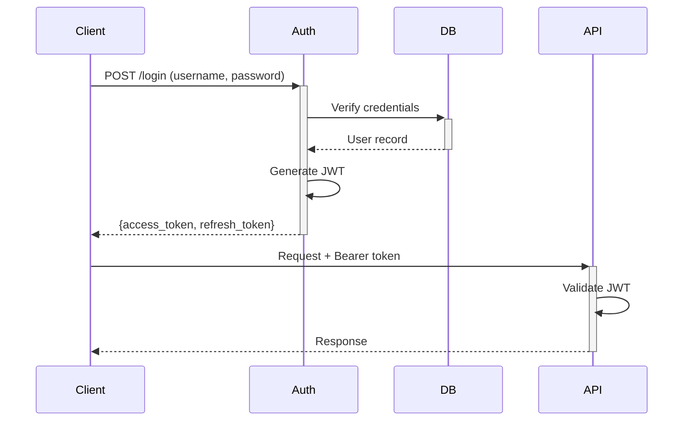

# Admin Module

> [Home](../CLAUDE.md) > Admin

## Overview

Backend management module providing authentication, CRUD operations for LLM providers, models, knowledge entries, and usage logging.

## Key Files

| File | Description |
|------|-------------|
| `routes.py` | FastAPI router with all admin API endpoints |
| `models.py` | SQLAlchemy ORM models |
| `schemas.py` | Pydantic schemas for request/response |
| `auth.py` | JWT authentication logic |
| `database.py` | Database session management |
| `usage_logger.py` | LLM usage logging |
| `rate_limiter.py` | Login rate limiting |
| `password_validator.py` | Password strength validation |

## Database Models (`models.py`)

| Model | Description |
|-------|-------------|
| `User` | User accounts |
| `LLMProvider` | LLM provider configurations |
| `LLMModel` | LLM model instances |
| `EmbeddingProvider` | Embedding service configs |
| `KnowledgeEntry` | Knowledge base entries |
| `KnowledgeGroup` | Knowledge grouping |
| `KnowledgeGroupItem` | Group-entry mapping |
| `KnowledgeVersion` | Version history |
| `KnowledgeTask` | Async task tracking |
| `MCPApiKey` | MCP API keys |
| `GroupShare` | Group sharing permissions |
| `LLMUsageLog` | Usage statistics |

## API Routes (`routes.py`)

### Authentication
- `POST /admin/api/auth/login` - User login
- `POST /admin/api/auth/refresh` - Refresh token
- `GET /admin/api/auth/me` - Current user info

### Providers & Models
- `CRUD /admin/api/providers` - LLM providers
- `CRUD /admin/api/models` - LLM models
- `CRUD /admin/api/embedding-providers` - Embedding providers

### Knowledge Management
- `CRUD /admin/api/knowledge` - Knowledge entries
- `CRUD /admin/api/groups` - Knowledge groups
- `POST /admin/api/groups/{id}/items` - Add items to group

### System
- `GET /admin/api/stats` - Dashboard statistics
- `GET /admin/api/usage/logs` - Usage logs
- `GET /admin/api/scheduler/status` - Scheduler status
- `POST /admin/api/models/test` - Test LLM model

### MCP Keys
- `CRUD /admin/api/api-keys` - MCP API key management

## Authentication Flow



## Security Features

- **Rate Limiting**: 5 failed attempts = 5 min lockout
- **Password Validation**: Min length, complexity rules
- **JWT Tokens**: Access (24h) + Refresh tokens
- **API Key Auth**: Alternative to JWT for MCP

## Dependencies

- SQLAlchemy + MySQL
- python-jose (JWT)
- passlib (password hashing)

## Database Setup

```sql
CREATE DATABASE IF NOT EXISTS rag_admin DEFAULT CHARACTER SET utf8mb4;
```

Tables are created automatically on first startup.
