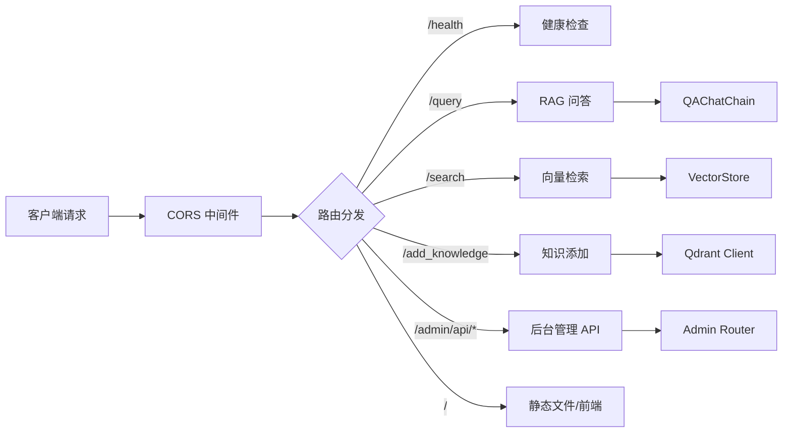

# API 服务模块

**导航**: [← 返回根目录](../CLAUDE.md) / **api/**

> FastAPI REST API 服务，提供 RAG 问答、向量检索和后台管理接口
>
> **最后更新**: 2025-12-08 23:06:35

## 模块概述

`api/` 模块是整个系统的 HTTP 服务入口，基于 FastAPI 框架构建，提供：
- RAG 问答接口
- 向量检索接口
- 知识添加接口
- 后台管理接口代理
- 静态文件服务
- CORS 跨域支持

## 核心文件

| 文件 | 职责 | 关键类/函数 |
|------|------|------------|
| `server.py` | FastAPI 应用入口 | `app`, `startup_event()`, 路由处理器 |
| `__init__.py` | 模块初始化 | - |

## 架构设计



## 核心功能

### 1. 启动初始化 (startup_event)

```python
@app.on_event("startup")
async def startup_event():
    # 初始化全局实例：
    - QAChatChain (问答链)
    - VectorStore (向量存储)
    - LLM Client (大模型客户端)
    - EmbeddingModel (嵌入模型)
    - QdrantClient (Qdrant 客户端)
```

**职责**: 在服务启动时一次性初始化所有依赖组件，确保后续请求可复用这些实例。

### 2. RAG 问答 (POST /query)

```python
QueryRequest:
  - question: str (用户问题)
  - top_k: int = 5 (检索条数)
  - filters: Optional[Dict] (过滤条件)
  - use_history: bool = True (是否使用历史对话)

QueryResponse:
  - answer: str (AI 回答)
  - sources: List[Dict] (参考来源)
  - retrieved_count: int (检索到的文档数)
```

**调用链**:
1. 接收用户问题
2. 调用 `qa_chain.ask()`
3. 内部触发混合检索 + 重排
4. 将检索结果作为上下文传递给 LLM
5. 返回 AI 回答及来源

### 3. 向量检索 (POST /search)

```python
SearchRequest:
  - query: str (检索问题)
  - top_k: int = 5
  - filters: Optional[Dict]
  - score_threshold: float = 0.0 (相似度阈值)

SearchResponse:
  - results: List[Dict] (检索结果列表)
```

**职责**: 纯检索功能，不调用 LLM，仅返回相似文档。

### 4. 知识添加 (POST /add_knowledge)

```python
AddKnowledgeRequest:
  - content: str (知识内容)
  - file_path: str (文件路径或标识)
  - metadata: Optional[Dict] (元数据)

AddKnowledgeResponse:
  - success: bool
  - point_id: str (Qdrant Point ID)
```

**职责**: 动态向向量数据库添加新知识条目。

### 5. 后台管理接口

通过 `app.include_router(admin_router)` 挂载所有后台管理 API：
- `/admin/api/auth/login` - 用户登录
- `/admin/api/stats` - 统计数据
- `/admin/api/providers` - LLM 供应商管理
- `/admin/api/models` - LLM 模型管理
- `/admin/api/knowledge` - 知识库管理
- `/admin/api/usage/*` - 使用日志和统计

详见 [admin/ 模块文档](../admin/CLAUDE.md)

## 依赖关系

### 上游依赖
- `qa.chain.QAChatChain` - 问答逻辑
- `retriever.vector_store.VectorStore` - 向量存储
- `utils.llm.get_llm_client` - LLM 客户端工厂
- `utils.embeddings.EmbeddingModel` - 嵌入模型
- `admin.routes.router` - 后台管理路由
- `admin.auth.get_current_user` - JWT 认证

### 下游消费者
- Web 前端 (`admin_frontend/`)
- MCP Server (`mcp_server/`)
- CLI 客户端
- 第三方集成

## 环境变量

| 变量 | 说明 | 默认值 |
|------|------|--------|
| `QDRANT_HOST` | Qdrant 主机地址 | `localhost` |
| `QDRANT_PORT` | Qdrant 端口 | `6333` |
| `QDRANT_API_KEY` | Qdrant 认证密钥 | `None` |
| `QDRANT_USE_HTTPS` | 是否使用 HTTPS | `False` |
| `QDRANT_COLLECTION_NAME` | 集合名称 | `rag_knowledge` |

## 启动命令

```bash
# 开发模式（自动重载）
uvicorn api.server:app --reload --host 0.0.0.0 --port 8000

# 生产模式
uvicorn api.server:app --host 0.0.0.0 --port 8000 --workers 4

# 使用脚本启动
./scripts/start_api.sh
```

## 测试

### 健康检查
```bash
curl http://localhost:8000/health
# Expected: {"status": "ok"}
```

### RAG 问答
```bash
curl -X POST http://localhost:8000/query \
  -H "Content-Type: application/json" \
  -d '{"question": "这个项目的主要功能是什么？"}'
```

### 向量检索
```bash
curl -X POST http://localhost:8000/search \
  -H "Content-Type: application/json" \
  -d '{"query": "嵌入模型", "top_k": 3}'
```

## 常见问题

### 1. CORS 错误？
检查 `CORSMiddleware` 配置，确保允许的来源包含你的前端地址。

### 2. 启动时连接 Qdrant 失败？
- 确保 Qdrant 服务已启动
- 检查 `QDRANT_HOST` 和 `QDRANT_PORT` 配置
- 如果使用 API Key，确保 `QDRANT_API_KEY` 正确

### 3. LLM 调用失败？
检查环境变量：
- `ANTHROPIC_API_KEY` 或 `OPENAI_API_KEY`
- `LLM_PROVIDER` 和 `LLM_MODEL`

## 后续改进

- [ ] 添加请求速率限制（防止滥用）
- [ ] 实现请求缓存机制
- [ ] 添加更细粒度的错误处理
- [ ] 集成 OpenTelemetry 进行链路追踪
- [ ] 添加 API 文档自动生成（Swagger UI）
