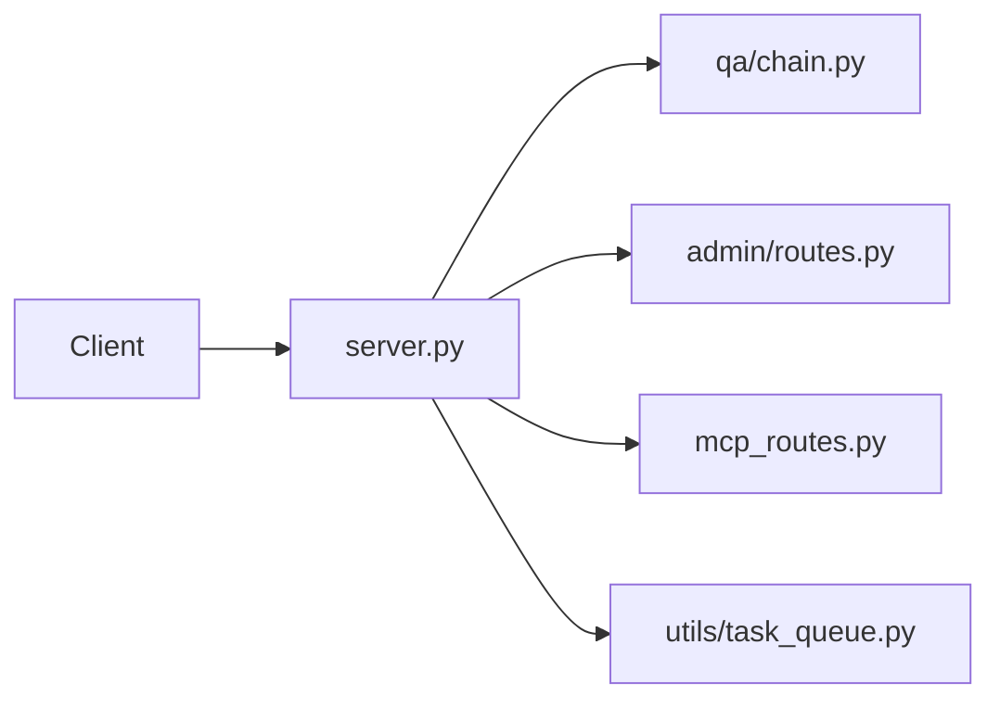

# API Module

> [Home](../CLAUDE.md) > API

## Overview

FastAPI REST API service - the main entry point for the RAG system.

## Key Files

| File | Description |
|------|-------------|
| `server.py` | Main FastAPI application, routes, middleware |
| `mcp_routes.py` | MCP-specific routes for Claude Desktop integration |

## Architecture



## Main Entry: `server.py`

### Key Components

- **CORS Configuration**: Configurable allowed origins
- **Static Files**: Serves admin frontend from `admin_frontend/dist`
- **Global Instances**: `qa_chain`, `vector_store`, `llm_client`, `embedding_model`

### Endpoints

| Method | Path | Description |
|--------|------|-------------|
| GET | `/health` | Health check |
| GET | `/` | Redirect to admin |
| POST | `/query` | RAG Q&A |
| POST | `/query/stream` | Streaming RAG Q&A (SSE) |
| POST | `/search` | Vector search |
| POST | `/add_knowledge` | Add knowledge (async) |
| GET | `/add_knowledge/status/{task_id}` | Check task status |
| POST | `/agent` | Agent tool calling |
| POST | `/clear-history` | Clear conversation |

### Lifecycle Events

```python
@app.on_event("startup")
async def startup_event():
    # Initialize: embedding, qdrant, llm, qa_chain, task_queue, scheduler

@app.on_event("shutdown")
async def shutdown_event():
    # Cleanup: stop task_queue, stop scheduler
```

## MCP Routes: `mcp_routes.py`

Handles MCP (Model Context Protocol) endpoints for Claude Desktop.

### Endpoints

| Method | Path | Description |
|--------|------|-------------|
| POST | `/mcp/verify` | Verify MCP API key |
| ANY | `/mcp/*` | MCP Streamable HTTP app |

## Dependencies

- `qa.chain.QAChatChain`
- `retriever.vector_store.VectorStore`
- `utils.llm.get_llm_client`
- `utils.embeddings.EmbeddingModel`
- `utils.task_queue.get_task_queue`
- `admin.routes` (router)
- `admin.auth.get_current_user`

## Configuration

Uses environment variables via `config.py`:
- `CORS_ALLOWED_ORIGINS`
- `QDRANT_*` settings
- `LLM_*` settings

## Running

```bash
# Development
uvicorn api.server:app --host 0.0.0.0 --port 8000 --reload

# Production
gunicorn api.server:app -c gunicorn_config.py
```
