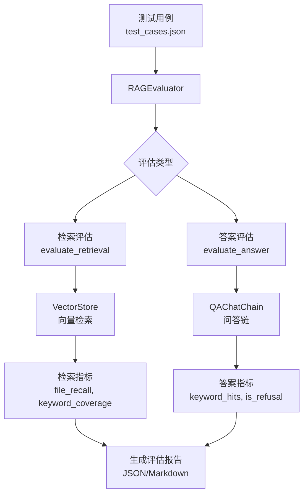

# 评估模块

**导航**: [← 返回根目录](../CLAUDE.md) / **eval/**

> RAG 系统检索质量和问答质量评估
>
> **最后更新**: 2025-12-08 23:26:20

## 模块概述

`eval/` 模块提供 RAG 系统的质量评估功能，包括:
- 检索质量评估（文件召回率、关键词覆盖）
- 问答质量评估（关键词匹配、拒答检测）
- 测试用例管理
- 评估报告生成

## 核心文件

| 文件 | 职责 | 关键类/函数 |
|------|------|------------|
| `evaluator.py` | RAG 评估器 | `RAGEvaluator` 类 |
| `test_cases.json` | 测试用例集 | JSON 格式测试数据 |
| `__init__.py` | 模块初始化 | - |

## 架构设计



## 核心类: RAGEvaluator

### 初始化

```python
class RAGEvaluator:
    """RAG 评估器"""

    def __init__(self):
        self.qa_chain = QAChatChain()
        self.vector_store = VectorStore()
        self.results = []  # 评估结果缓存
```

### 关键方法

#### 1. load_test_cases() - 加载测试用例

```python
def load_test_cases(
    self,
    file_path: Path = None
) -> List[Dict]:
    """
    加载测试用例

    测试用例格式：
    {
        "question": "问题文本",
        "expected_files": ["文件路径1", "文件路径2"],
        "expected_keywords": ["关键词1", "关键词2"],
        "category": "测试类别"
    }
    """
```

#### 2. evaluate_retrieval() - 检索质量评估

```python
def evaluate_retrieval(
    self,
    test_case: Dict,
    retrieved_results: List[Dict]
) -> Dict:
    """
    评估检索质量

    指标：
    1. file_recall: 文件召回率（检索到的期望文件 / 总期望文件）
    2. keyword_coverage: 关键词覆盖率（命中关键词 / 总期望关键词）
    3. avg_score: 平均相似度分数
    4. retrieved_count: 检索到的文档数量

    Returns:
        {
            "file_recall": float (0-1),
            "file_hits": List[Dict],
            "keyword_coverage": float (0-1),
            "keyword_hits": List[str],
            "retrieved_count": int,
            "avg_score": float
        }
    """
```

#### 3. evaluate_answer() - 答案质量评估

```python
def evaluate_answer(
    self,
    test_case: Dict,
    answer: str
) -> Dict:
    """
    评估答案质量

    指标：
    1. keyword_coverage: 答案中包含的期望关键词覆盖率
    2. is_refusal: 是否拒绝回答（无法找到相关信息）
    3. answer_length: 答案长度

    拒答检测短语：
    - "无法找到"
    - "没有找到"
    - "不确定"
    - "无法回答"

    Returns:
        {
            "keyword_coverage": float (0-1),
            "keyword_hits": List[str],
            "is_refusal": bool,
            "answer_length": int
        }
    """
```

#### 4. evaluate_test_case() - 评估单个测试用例

```python
def evaluate_test_case(self, test_case: Dict) -> Dict:
    """
    评估单个测试用例

    流程：
    1. 执行向量检索
    2. 评估检索质量
    3. 执行问答
    4. 评估答案质量
    5. 合并结果

    Returns:
        {
            "question": str,
            "retrieval": {...},  # 检索指标
            "answer": {...},      # 答案指标
            "qa_result": {...},   # 完整问答结果
            "timestamp": str
        }
    """
```

#### 5. evaluate_all() - 批量评估

```python
def evaluate_all(
    self,
    test_cases_file: Path = None
) -> List[Dict]:
    """
    评估所有测试用例

    Returns:
        评估结果列表
    """
```

#### 6. generate_report() - 生成评估报告

```python
def generate_report(
    self,
    output_path: Path = None,
    format: str = "json"
) -> str:
    """
    生成评估报告

    支持格式：
    - json: JSON 格式
    - markdown: Markdown 格式
    - html: HTML 格式（TODO）

    报告内容：
    - 总体统计（平均指标、通过率）
    - 逐条测试结果
    - 失败用例分析
    """
```

## 测试用例格式

### test_cases.json 示例

```json
[
    {
        "question": "这个项目的主要功能是什么？",
        "expected_files": [
            "README.md",
            "CLAUDE.md"
        ],
        "expected_keywords": [
            "RAG",
            "知识库",
            "检索增强",
            "问答系统"
        ],
        "category": "项目概述"
    },
    {
        "question": "如何配置嵌入模型？",
        "expected_files": [
            "utils/embeddings.py",
            "config.py"
        ],
        "expected_keywords": [
            "EMBEDDING_MODEL",
            "BGE-M3",
            "sentence-transformers"
        ],
        "category": "配置说明"
    }
]
```

## 评估指标

### 基础检索指标

| 指标 | 说明 | 计算公式 | 目标值 |
|------|------|----------|--------|
| `file_recall` | 文件召回率 | 检索到的期望文件数 / 总期望文件数 | ≥ 0.8 |
| `keyword_coverage` | 关键词覆盖率 | 命中关键词数 / 总期望关键词数 | ≥ 0.7 |
| `avg_score` | 平均相似度 | Σ(score) / 检索数量 | ≥ 0.7 |
| `retrieved_count` | 检索文档数 | - | = top_k |

### 高级检索指标（IR 标准指标）

| 指标 | 说明 | 计算公式 | 目标值 |
|------|------|----------|--------|
| `mrr` | 平均倒数排名 | 1 / (第一个相关文档的排名) | ≥ 0.7 |
| `map` | 平均精度均值 | Σ(P@k * rel(k)) / 相关文档数 | ≥ 0.6 |
| `precision_at_k` | K 位精确率 | Top-K 中相关文档数 / K | ≥ 0.5 |
| `recall_at_k` | K 位召回率 | Top-K 中相关文档数 / 总相关文档数 | ≥ 0.8 |
| `ndcg_at_k` | 归一化折损累积增益 | DCG@K / IDCG@K | ≥ 0.7 |

**指标详解**:
- **MRR (Mean Reciprocal Rank)**: 衡量第一个相关结果的排名质量
- **MAP (Mean Average Precision)**: 综合考虑所有相关结果的排名
- **Precision@K**: 前 K 个结果中相关结果的比例
- **Recall@K**: 前 K 个结果覆盖了多少相关文档
- **NDCG@K**: 考虑排名位置的加权相关性得分

### 答案指标

| 指标 | 说明 | 计算公式 | 目标值 |
|------|------|----------|--------|
| `keyword_coverage` | 答案关键词覆盖 | 答案中的关键词数 / 总期望关键词数 | ≥ 0.6 |
| `is_refusal` | 是否拒答 | 包含拒答短语 | False（对有答案的问题） |
| `answer_length` | 答案长度 | 字符数 | > 50 |

### 综合指标

| 指标 | 说明 | 计算公式 |
|------|------|----------|
| `pass_rate` | 测试通过率 | 通过测试数 / 总测试数 |
| `avg_retrieval_score` | 平均检索得分 | Σ(file_recall + keyword_coverage) / (2 * 测试数) |
| `avg_answer_score` | 平均答案得分 | Σ(keyword_coverage) / 测试数 |

## 使用示例

### 命令行评估

```bash
# 运行评估
python eval/evaluator.py

# 使用自定义测试用例
python eval/evaluator.py --test-cases eval/custom_cases.json

# 生成 Markdown 报告
python eval/evaluator.py --format markdown --output eval/report.md
```

### 代码调用

```python
from eval.evaluator import RAGEvaluator

# 初始化评估器
evaluator = RAGEvaluator()

# 加载测试用例
test_cases = evaluator.load_test_cases()

# 评估所有测试
results = evaluator.evaluate_all()

# 生成报告
report_path = evaluator.generate_report(
    output_path=Path("eval/report.json"),
    format="json"
)

# 打印统计
print(f"总测试数: {len(results)}")
print(f"平均文件召回率: {sum(r['retrieval']['file_recall'] for r in results) / len(results):.2f}")
```

## 评估报告示例

### JSON 格式

```json
{
    "summary": {
        "total_tests": 10,
        "pass_rate": 0.8,
        "avg_file_recall": 0.85,
        "avg_keyword_coverage": 0.75,
        "avg_answer_score": 0.70
    },
    "results": [
        {
            "question": "...",
            "retrieval": {...},
            "answer": {...},
            "passed": true
        }
    ],
    "failed_cases": [...]
}
```

### Markdown 格式

```markdown
# RAG 系统评估报告

生成时间: 2025-12-08 23:26:20

## 总体统计

- 总测试数: 10
- 通过率: 80.0%
- 平均文件召回率: 85.0%
- 平均关键词覆盖: 75.0%

## 详细结果

### ✅ 通过的测试用例 (8)

1. 这个项目的主要功能是什么？
   - 文件召回: 100% (2/2)
   - 关键词覆盖: 100% (4/4)

### ❌ 失败的测试用例 (2)

1. 如何启用 Reranker？
   - 文件召回: 50% (1/2) - 缺失: config.py
   - 关键词覆盖: 66.7% (2/3)
```

## 依赖关系

### 上游依赖
- `qa.chain.QAChatChain` - 问答链
- `retriever.vector_store.VectorStore` - 向量检索
- `utils.logger` - 日志记录

### 下游消费者
- CI/CD 管道（自动化测试）
- 性能监控系统
- 开发人员（手动评估）

## 常见问题

### 1. 评估指标如何解读？
- **file_recall \u003c 0.8**: 检索不到期望文件，可能需要优化索引或嵌入模型
- **keyword_coverage \u003c 0.7**: 检索到的内容相关性不足
- **is_refusal = True**: LLM 拒绝回答，可能是检索质量差或提示词问题

### 2. 如何添加新测试用例？
编辑 `eval/test_cases.json`，添加新的测试对象。

### 3. 评估速度慢？
- 减少测试用例数量
- 使用更小的 `top_k` 值
- 禁用 Reranker（评估时）

## 后续改进

- [x] 支持更多指标（MRR, NDCG, Precision@K, Recall@K, MAP）✅ 已完成
- [ ] 自动化测试集成（pytest）
- [ ] 可视化评估结果（图表）
- [ ] 支持人工标注和反馈
- [ ] 实现 A/B 测试对比
- [ ] 添加性能基准测试
