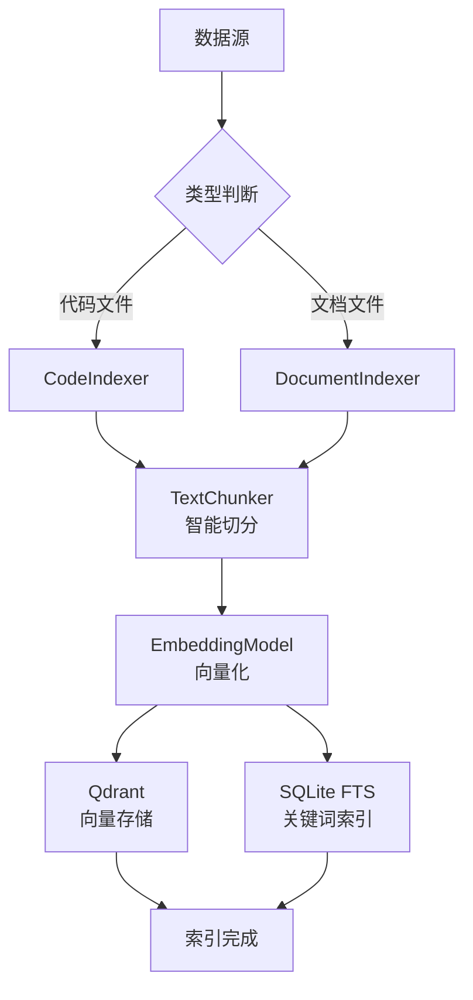

# 索引模块

**导航**: [← 返回根目录](../CLAUDE.md) / **indexer/**

> 代码库和文档的索引、切分、向量化
>
> **最后更新**: 2025-12-08 23:06:35

## 模块概述

`indexer/` 模块负责将各种数据源（代码、Markdown、PDF 等）索引到向量数据库和关键词索引，包括：
- 代码文件索引（Python, JS, TS, Java 等）
- 文档索引（Markdown, PDF, TXT）
- 智能文本切分
- 向量化和存储

## 核心文件

| 文件 | 职责 | 关键类/函数 |
|------|------|------------|
| `index_all.py` | 索引主入口 | `main()` 函数 |
| `code_indexer.py` | 代码索引器 | `CodeIndexer` 类 |
| `doc_indexer.py` | 文档索引器 | `DocumentIndexer` 类 |
| `chunker.py` | 文本切分器 | `TextChunker` 类 |
| `__init__.py` | 模块初始化 | - |

## 架构设计



## 核心类

### 1. CodeIndexer (code_indexer.py)

#### 功能
- 扫描代码库文件
- 识别代码类型（Python, JS, TS, Java 等）
- 按函数/类切分代码
- 提取元数据（函数名、类名、注释）

#### 关键方法
```python
class CodeIndexer:
    def __init__(self):
        self.chunker = TextChunker()
        self.embedding_model = EmbeddingModel()
        self.vector_store = VectorStore()

    def index_directory(
        self,
        directory: Path = None,
        extensions: List[str] = None
    ) -> Dict:
        """
        索引代码目录

        流程：
        1. 扫描目录，过滤文件（.gitignore, 二进制文件）
        2. 识别代码类型
        3. 读取文件内容
        4. 调用 chunker 切分
        5. 向量化每个 chunk
        6. 存储到 Qdrant 和 SQLite
        7. 返回统计信息
        """

    def index_file(self, file_path: Path) -> int:
        """索引单个代码文件"""
```

#### 支持的代码类型
- Python (`.py`)
- JavaScript (`.js`, `.jsx`)
- TypeScript (`.ts`, `.tsx`)
- Java (`.java`)
- Go (`.go`)
- C/C++ (`.c`, `.cpp`, `.h`)
- Rust (`.rs`)

### 2. DocumentIndexer (doc_indexer.py)

#### 功能
- 索引文档文件（Markdown, PDF, TXT）
- 解析 Markdown 结构（标题、列表、代码块）
- 提取 PDF 文本
- 元数据提取（标题、作者、创建时间）

#### 关键方法
```python
class DocumentIndexer:
    def __init__(self):
        self.chunker = TextChunker()
        self.embedding_model = EmbeddingModel()
        self.vector_store = VectorStore()

    def index_directory(
        self,
        directory: Path = None,
        extensions: List[str] = None
    ) -> Dict:
        """索引文档目录"""

    def index_markdown(self, file_path: Path) -> int:
        """索引 Markdown 文件（按标题切分）"""

    def index_pdf(self, file_path: Path) -> int:
        """索引 PDF 文件（使用 PyPDF2）"""

    def index_text(self, file_path: Path) -> int:
        """索引纯文本文件"""
```

#### 支持的文档类型
- Markdown (`.md`)
- PDF (`.pdf`)
- 纯文本 (`.txt`)

### 3. TextChunker (chunker.py)

#### 功能
- 智能文本切分（避免切断句子、代码块）
- 支持多种切分策略
- 保留上下文重叠

#### 关键方法
```python
class TextChunker:
    def __init__(
        self,
        chunk_size: int = 1000,
        chunk_overlap: int = 200
    ):
        self.chunk_size = chunk_size
        self.chunk_overlap = chunk_overlap

    def chunk_text(
        self,
        text: str,
        metadata: Dict = None
    ) -> List[Dict]:
        """
        切分文本为 chunks

        策略：
        1. 按段落分割
        2. 合并小段落，确保每个 chunk 接近目标大小
        3. 添加上下文重叠（保留前一个 chunk 的尾部）
        4. 附加元数据（file_path, chunk_index, type 等）
        """

    def chunk_code(
        self,
        code: str,
        language: str,
        metadata: Dict = None
    ) -> List[Dict]:
        """
        切分代码（按函数/类）

        使用 Tree-sitter 或简单的正则表达式
        """
```

#### 切分策略

**文档切分**:
1. 按段落（`\n\n`）分割
2. 合并小段落（< 100 字符）
3. 拆分大段落（> chunk_size）
4. 添加重叠（保留上一个 chunk 的最后 200 字符）

**代码切分**:
1. 按函数/类边界切分
2. 保留函数签名和注释
3. 如果函数过大，按逻辑块切分

### 4. index_all.py (主入口)

#### 功能
- 协调代码和文档索引
- 输出统计信息
- 错误处理和日志

#### 使用方式
```bash
# 索引所有数据
python indexer/index_all.py

# 或使用脚本
./scripts/index_project.sh
```

#### 输出示例
```
[INFO] 开始索引所有数据...
==================================================
[INFO] 开始索引代码库...
[INFO] 索引文件: api/server.py (2 chunks)
[INFO] 索引文件: qa/chain.py (3 chunks)
...
[INFO] 代码索引完成: {'files': 42, 'chunks': 156, 'errors': 0}
==================================================
[INFO] 开始索引文档...
[INFO] 索引文件: README.md (5 chunks)
[INFO] 索引文件: SETUP_GUIDE.md (3 chunks)
...
[INFO] 文档索引完成: {'files': 15, 'chunks': 67, 'errors': 0}
==================================================
[INFO] 索引完成！总统计: {
  "total_files": 57,
  "total_chunks": 223,
  "total_errors": 0,
  "code_files": 42,
  "code_chunks": 156,
  "doc_files": 15,
  "doc_chunks": 67
}
```

## 元数据字段

### 通用元数据
```python
{
    "file_path": str,         # 文件路径
    "type": str,              # "code" 或 "doc"
    "language": str,          # 编程语言或文档类型
    "chunk_index": int,       # Chunk 序号
    "total_chunks": int,      # 文件总 chunks 数
    "created_at": datetime,   # 索引时间
}
```

### 代码特定元数据
```python
{
    "function_name": str,     # 函数名
    "class_name": str,        # 类名
    "line_start": int,        # 起始行号
    "line_end": int,          # 结束行号
}
```

### 文档特定元数据
```python
{
    "title": str,             # 文档标题
    "section": str,           # 章节标题
}
```

## 忽略规则

### 默认忽略
- `.git/`, `.gitignore`
- `node_modules/`, `venv/`, `__pycache__/`
- `*.pyc`, `*.pyo`, `*.so`, `*.dll`
- `dist/`, `build/`, `target/`
- 二进制文件（图片、视频、音频）

### 自定义忽略
在 `.ragignore` 文件中添加规则（语法同 `.gitignore`）：
```
# 忽略测试文件
**/tests/
**/*_test.py

# 忽略特定目录
old_code/
archived/
```

## 依赖关系

### 上游依赖
- `utils.embeddings.EmbeddingModel` - 嵌入模型
- `retriever.vector_store.VectorStore` - 向量存储
- `qdrant_client` - Qdrant 客户端
- `sqlite3` - SQLite 数据库

### 下游消费者
- 索引脚本 (`scripts/index_project.sh`)
- API 端点 (`POST /add_knowledge`)

## 环境变量

继承自主配置：
- `QDRANT_HOST`, `QDRANT_PORT` - Qdrant 连接
- `EMBEDDING_MODEL` - 嵌入模型
- `BASE_DIR` - 项目根目录

## 性能优化

### 1. 批量处理
```python
# 批量向量化（减少模型调用次数）
embeddings = embedding_model.encode_batch(texts)

# 批量插入 Qdrant
vector_store.add_points_batch(points)
```

### 2. 并行处理
```python
from concurrent.futures import ThreadPoolExecutor

with ThreadPoolExecutor(max_workers=4) as executor:
    futures = [executor.submit(index_file, f) for f in files]
```

### 3. 增量索引
```python
# 仅索引新增/修改的文件
if file_path.stat().st_mtime > last_indexed_time:
    index_file(file_path)
```

## 常见问题

### 1. 索引速度慢？
- 减少 chunk 数量（增大 `chunk_size`）
- 启用批量处理
- 使用并行索引

### 2. 内存占用过高？
- 减少批处理大小
- 逐个文件处理，及时释放内存

### 3. 某些文件无法索引？
- 检查文件编码（应为 UTF-8）
- 检查是否在忽略列表中
- 查看日志中的错误信息

## 后续改进

- [ ] 支持增量索引（仅索引变更文件）
- [ ] 添加索引进度条
- [ ] 支持更多文档类型（DOCX, HTML, Jupyter Notebook）
- [ ] 实现代码语法解析（Tree-sitter）
- [ ] 添加索引去重检测
- [ ] 支持分布式索引（多机器并行）
