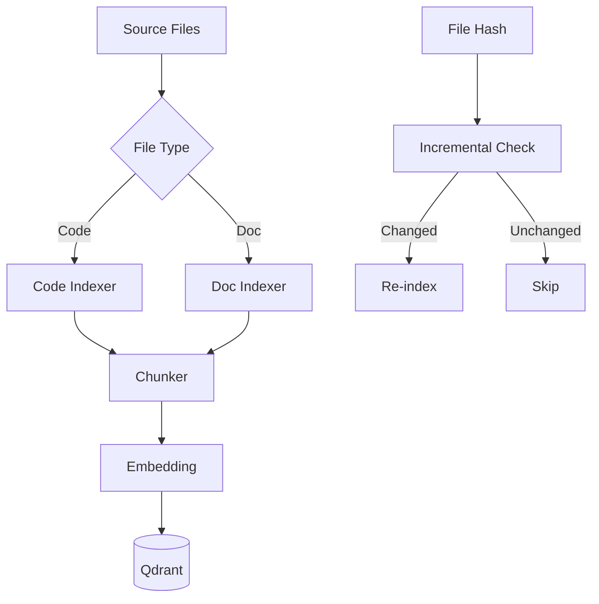

# Indexer Module

> [Home](../CLAUDE.md) > Indexer

## Overview

Data indexing system for code and documents with intelligent chunking and incremental updates.

## Key Files

| File | Description |
|------|-------------|
| `index_all.py` | Unified indexing entry point |
| `code_indexer.py` | Code file parser and indexer |
| `doc_indexer.py` | Document (MD, PDF, Word) indexer |
| `chunker.py` | Text chunking with context prefix |
| `incremental.py` | Hash-based incremental indexing |

## Architecture



## Index All (`index_all.py`)

CLI entry point:

```bash
python -m indexer.index_all [options]

Options:
  --full            Force full re-index
  --incremental     Incremental mode (default)
  --code-dir PATH   Override code directory
  --doc-dir PATH    Override doc directory
  --clear-state     Clear index state
  --stats           Show index statistics
```

### Functions

```python
def find_code_files(root_path) -> List[str]
def find_doc_files(root_path) -> List[str]
```

## Code Indexer (`code_indexer.py`)

Parses code files with language-aware chunking:

```python
class CodeIndexer:
    def index_file(self, file_path) -> List[Dict]
    def parse_functions(self, content, language) -> List[Dict]
```

Supported languages:
- Python (*.py)
- JavaScript/TypeScript (*.js, *.ts, *.vue)
- PHP (*.php)

## Document Indexer (`doc_indexer.py`)

Handles various document formats:

```python
class DocumentIndexer:
    def index_file(self, file_path) -> List[Dict]
```

Supported formats:
- Markdown (*.md)
- Plain text (*.txt)
- PDF (*.pdf) - via PyPDF2
- Word (*.docx) - via python-docx

## Chunker (`chunker.py`)

Intelligent text splitting with context awareness:

```python
class Chunker:
    def chunk(self, text, chunk_size=512, overlap=50) -> List[str]
```

### Contextual Chunking

When enabled (`CONTEXT_PREFIX_ENABLE=1`):
- Adds document context as prefix to each chunk
- Improves retrieval accuracy for code/docs

Configuration:
```python
CHUNK_SIZE = 512
CHUNK_OVERLAP = 50
CONTEXT_PREFIX_MAX_LEN = 100
```

## Incremental Indexer (`incremental.py`)

Hash-based change detection:

```python
class IncrementalIndexer:
    def should_index(self, file_path) -> bool
    def mark_indexed(self, file_path, qdrant_ids)
    def get_stats() -> Dict
```

Uses SQLite to track:
- File hashes
- Qdrant point IDs per file
- Last index timestamp

## Configuration

```python
# config.py
CODE_PATTERNS = ["*.py", "*.js", "*.vue", "*.md"]
IGNORE_PATTERNS = ["node_modules/**", "vendor/**", ".git/**"]
PROJECT_ROOT = Path(...)
```

## Dependencies

- Qdrant client
- Embedding model
- PyPDF2 (optional)
- python-docx (optional)
