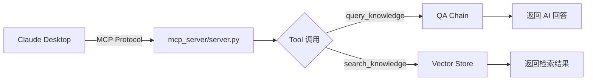

# MCP Server 模块

**导航**: [← 返回根目录](../CLAUDE.md) / **mcp_server/**

> Claude Desktop MCP 集成，提供知识库问答和检索能力
>
> **最后更新**: 2025-12-08 23:06:35

## 模块概述

`mcp_server/` 模块实现了 Model Context Protocol (MCP) 服务器，允许 Claude Desktop 直接调用 RAG 知识库的问答和检索功能。

## 核心文件

| 文件 | 职责 | 关键函数 |
|------|------|----------|
| `server.py` | MCP 服务器入口 | `query_knowledge()`, `search_knowledge()` |
| `__init__.py` | 模块初始化 | - |

## MCP 协议简介

MCP (Model Context Protocol) 是 Anthropic 提供的协议，允许：
- Claude Desktop 调用外部工具
- 扩展 Claude 的能力（如访问本地知识库、执行代码等）
- 实现无缝的工具集成

## 架构设计



## 提供的工具

### 1. query_knowledge
```python
功能：基于 RAG 的智能问答

输入参数：
- question: str (用户问题)
- top_k: int = 5 (检索条数)

返回：
- answer: str (AI 回答)
- sources: List[Dict] (参考来源)
- retrieved_count: int
```

**使用场景**: 用户在 Claude Desktop 中询问项目相关问题，自动检索知识库并生成回答。

### 2. search_knowledge
```python
功能：向量检索（不调用 LLM）

输入参数：
- query: str (检索问题)
- top_k: int = 5

返回：
- results: List[Dict] (检索结果列表)
```

**使用场景**: 快速查找相关文档，不需要 AI 生成回答。

## 配置 Claude Desktop

### 1. 安装 MCP Server
编辑 Claude Desktop 配置文件：
```json
// macOS: ~/Library/Application Support/Claude/claude_desktop_config.json
// Windows: %APPDATA%/Claude/claude_desktop_config.json
{
  "mcpServers": {
    "rag": {
      "command": "python",
      "args": ["/path/to/rag/mcp_server/server.py"]
    }
  }
}
```

### 2. 重启 Claude Desktop
配置后重启 Claude Desktop，MCP Server 将自动启动。

### 3. 使用工具
在对话中，Claude 会自动调用 `query_knowledge` 或 `search_knowledge` 工具来回答问题。

## 启动与测试

### 手动启动（测试）
```bash
cd /path/to/rag
python mcp_server/server.py
```

### 日志查看
MCP Server 的日志会输出到标准错误流（stderr）：
```bash
python mcp_server/server.py 2> mcp_server.log
```

### 测试工具调用
在 Claude Desktop 中输入：
```
帮我查询一下这个项目的主要功能是什么？
```

Claude 应该会自动调用 `query_knowledge` 工具。

## 依赖关系

### 上游依赖
- `qa.chain.QAChatChain` - 问答链
- `retriever.vector_store.VectorStore` - 向量存储
- `utils.logger` - 日志记录
- `mcp` (Python MCP SDK)

### 下游消费者
- Claude Desktop 客户端

## 环境变量

MCP Server 会继承主应用的环境变量：
- `ANTHROPIC_API_KEY`
- `QDRANT_HOST`, `QDRANT_PORT`
- `EMBEDDING_MODEL`
- `RERANKER_ENABLE`

## 常见问题

### 1. Claude Desktop 找不到工具？
- 检查配置文件路径是否正确
- 确保 Python 路径和脚本路径都是绝对路径
- 重启 Claude Desktop

### 2. MCP Server 启动失败？
- 检查日志输出（stderr）
- 确保 Qdrant 服务已启动
- 验证环境变量配置

### 3. 工具调用超时？
增加 Claude Desktop 的超时配置（如果支持），或优化检索性能。

## 后续改进

- [ ] 添加更多工具（如添加知识、清空历史）
- [ ] 支持流式响应（实时显示生成过程）
- [ ] 实现工具调用统计和监控
- [ ] 添加工具调用权限控制
- [ ] 支持多用户隔离（基于 Claude Desktop 用户 ID）
