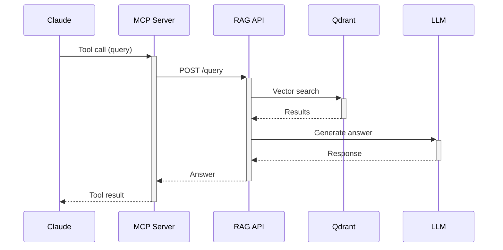

# MCP Server Module

> [Home](../CLAUDE.md) > MCP Server

## Overview

Model Context Protocol server for Claude Desktop integration. Enables Claude to query and manage the knowledge base.

## Key Files

| File | Description |
|------|-------------|
| `server.py` | FastMCP server implementation |

## Running Modes

### 1. stdio Mode (Default)

For single Claude Desktop session:

```bash
RAG_API_KEY=rag_sk_xxx python mcp_server/server.py
```

Claude Desktop config:
```json
{
  "mcpServers": {
    "rag-knowledge": {
      "command": "python",
      "args": ["/path/to/rag/mcp_server/server.py"],
      "env": {
        "RAG_API_KEY": "rag_sk_your_key"
      }
    }
  }
}
```

### 2. HTTP Mode (Multi-session)

For multiple concurrent Claude sessions:

```bash
RAG_API_KEY=rag_sk_xxx python mcp_server/server.py --http
# or
MCP_TRANSPORT=http RAG_API_KEY=rag_sk_xxx python mcp_server/server.py
```

Claude Desktop config:
```json
{
  "mcpServers": {
    "rag-knowledge": {
      "url": "http://localhost:8766/sse"
    }
  }
}
```

## MCP Tools

| Tool | Description |
|------|-------------|
| `query` | RAG Q&A with optional group filtering |
| `search` | Vector similarity search |
| `add_knowledge` | Add knowledge entry (async) |
| `delete_knowledge` | Remove knowledge entry |
| `list_groups` | List knowledge groups |
| `stats` | Get knowledge base statistics |

## Authentication

### API Key (Recommended)

```python
RAG_API_KEY = os.environ.get("RAG_API_KEY", "")
```

- Created via Admin Dashboard > MCP API Keys
- Verified against `/mcp/verify` endpoint
- Cached for 5 minutes

### Legacy Username/Password

```python
MCP_USERNAME = os.environ.get("RAG_MCP_USERNAME", "")
MCP_PASSWORD = os.environ.get("RAG_MCP_PASSWORD", "")
```

## Configuration

```python
RAG_API_BASE = "https://rag.litxczv.shop"  # Remote API
MCP_HOST = "127.0.0.1"
MCP_PORT = 8766
SEARCH_SCORE_THRESHOLD = 0.4
ADD_KNOWLEDGE_MAX_WAIT = 120  # seconds
```

## Architecture



## Thread Safety

- Uses threading locks for auth token caching
- Supports concurrent tool calls in HTTP mode

## Installation via uvx

```bash
uvx --from git+https://github.com/fengshao1227/woerk_rag.git rag-mcp
```

## Dependencies

- mcp[cli] >= 1.0.0
- httpx >= 0.25.0
