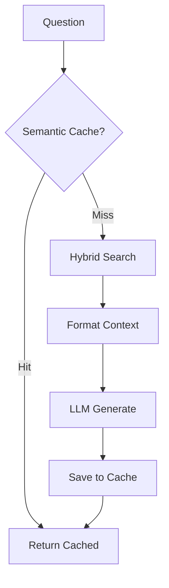

# Q&A Module

> [Home](../CLAUDE.md) > Q&A

## Overview

Question-answering chain with conversation memory, semantic caching, and streaming support.

## Key Files

| File | Description |
|------|-------------|
| `chain.py` | Main `QAChatChain` class |
| `cli.py` | Command-line Q&A interface |
| `conversation_summarizer.py` | Conversation compression |

## Core Class: `QAChatChain`

### Initialization

```python
class QAChatChain:
    def __init__(self, enable_cache=True, enable_summarization=True):
        self.llm = get_llm_client()
        self.retriever = HybridSearch()
        self.conversation_history = []
        self.semantic_cache = SemanticCache()  # if enabled
        self.summarizer = ConversationSummarizer()  # if enabled
```

### Key Methods

| Method | Description |
|--------|-------------|
| `ask(question, top_k, group_names)` | Synchronous Q&A |
| `ask_stream(question, ...)` | Streaming Q&A (generator) |
| `clear_history()` | Reset conversation |

### Flow



## Conversation Summarizer

Compresses conversation history when it exceeds threshold:

```python
# Config from config.py
CONVERSATION_MAX_HISTORY_TURNS = 10  # Trigger threshold
CONVERSATION_KEEP_RECENT_TURNS = 4   # Keep recent N turns
CONVERSATION_MAX_SUMMARY_CHARS = 1000
```

### Compression Logic

1. When turns > MAX_HISTORY_TURNS
2. Summarize older turns into a paragraph
3. Keep recent N turns intact
4. Store summary as `conversation_summary`

## Context Limits

```python
MAX_CONTEXT_CHARS = 8000       # Total context limit
MAX_SINGLE_CONTENT_CHARS = 2000  # Per-document limit
```

## CLI Usage

```bash
python -m qa.cli

# Interactive mode
> What is this project about?
> /clear  # Clear history
> /exit   # Exit
```

## Dependencies

- `retriever.hybrid_search.HybridSearch`
- `retriever.semantic_cache.SemanticCache`
- `utils.llm.get_llm_client`
