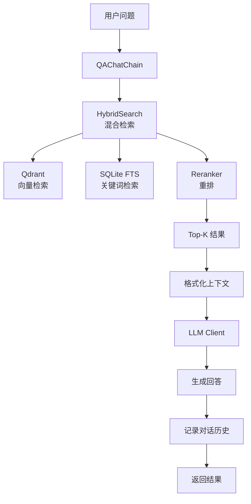

# 问答模块

**导航**: [← 返回根目录](../CLAUDE.md) / **qa/**

> 基于 LangChain 的 QA Chain 和 CLI 交互
>
> **最后更新**: 2025-12-08 23:06:35

## 模块概述

`qa/` 模块提供核心的问答功能，包括：
- QA Chain 实现（基于 LangChain）
- 对话历史管理
- 上下文长度控制
- CLI 交互式问答

## 核心文件

| 文件 | 职责 | 关键类/函数 |
|------|------|------------|
| `chain.py` | QA Chain 实现 | `QAChatChain` 类 |
| `cli.py` | CLI 交互界面 | `main()` 函数 |
| `__init__.py` | 模块初始化 | - |

## 架构设计



## 核心类: QAChatChain

### 初始化
```python
def __init__(self):
    self.llm = get_llm_client()           # LLM 客户端
    self.retriever = HybridSearch()       # 混合检索器
    self.conversation_history = []        # 对话历史
```

### 关键方法

#### 1. ask() - 问答主方法
```python
def ask(
    self,
    question: str,
    top_k: int = 5,
    filters: Optional[Dict] = None,
    use_history: bool = True
) -> Dict:
    """
    处理用户问题，返回 AI 回答

    流程：
    1. 调用混合检索器获取相关文档
    2. 格式化检索结果为上下文（带长度限制）
    3. 构建 LLM 消息（系统提示 + 历史对话 + 当前问题）
    4. 调用 LLM 生成回答
    5. 记录对话历史
    6. 返回结果
    """
```

#### 2. _format_context() - 格式化上下文
```python
def _format_context(self, results: List[Dict]) -> str:
    """
    将检索结果格式化为上下文字符串

    限制：
    - MAX_CONTEXT_CHARS = 8000 (约 4000 tokens)
    - MAX_SINGLE_CONTENT_CHARS = 2000 (单条内容最大)

    格式：
    [参考 1] 文件: {file_path}
    相似度: {score}
    内容:
    {content}
    ---
    """
```

**长度控制策略**:
1. 截断单条内容（保留前后部分，中间省略）
2. 按顺序添加条目，超出总长度限制则停止
3. 确保 LLM 输入不超过上下文窗口

#### 3. _truncate_content() - 内容截断
```python
def _truncate_content(
    self,
    content: str,
    max_chars: int = MAX_SINGLE_CONTENT_CHARS
) -> str:
    """
    截断过长的内容，保留前后部分

    示例：
    原文：[0:2000] 字符
    截断后：[0:480] + "\\n\\n... [内容已截断] ...\\n\\n" + [-480:]
    """
```

#### 4. clear_history() - 清空历史
```python
def clear_history(self):
    """清空对话历史"""
    self.conversation_history = []
```

## CLI 交互 (cli.py)

### 功能
- 交互式问答循环
- 彩色输出（问题/回答/参考来源）
- 历史对话自动记录
- 退出命令（`quit`, `exit`, `q`）
- 清空历史命令（`clear`）

### 使用方式
```bash
# 直接运行
python qa/cli.py

# 或使用脚本
./scripts/chat.sh
```

### 示例对话
```
🤖 RAG 知识库问答系统
输入问题（输入 'quit' 退出，'clear' 清空历史）：

你: 这个项目的主要功能是什么？

🤔 正在检索相关知识...
📚 找到 5 条相关内容

🤖 回答：
这个项目是一个 RAG 知识库系统...

📖 参考来源：
1. README.md (相似度: 0.892)
2. qa/chain.py (相似度: 0.756)
```

## 对话历史管理

### 历史记录格式
```python
conversation_history = [
    {"role": "user", "content": "问题1"},
    {"role": "assistant", "content": "回答1"},
    {"role": "user", "content": "问题2"},
    {"role": "assistant", "content": "回答2"},
    ...
]
```

### 历史记录用途
- 提供上下文连贯性
- 支持多轮对话
- 避免重复回答

### 历史长度限制与摘要压缩

系统实现了自动对话摘要压缩功能：

**触发条件**:
- 对话轮数超过 `CONVERSATION_MAX_HISTORY_TURNS`（默认 10 轮）

**压缩策略**:
1. 保留最近 `CONVERSATION_KEEP_RECENT_TURNS` 轮（默认 4 轮）完整对话
2. 早期对话自动调用 LLM 生成摘要
3. 摘要作为系统上下文注入后续对话

**配置项**:
```bash
CONVERSATION_SUMMARIZE_ENABLE=1      # 启用对话摘要
CONVERSATION_MAX_HISTORY_TURNS=10    # 触发摘要的轮数阈值
CONVERSATION_KEEP_RECENT_TURNS=4     # 保留的最近轮数
CONVERSATION_MAX_SUMMARY_CHARS=1000  # 摘要最大字符数
```

**相关文件**: `qa/conversation_summarizer.py`

## 依赖关系

### 上游依赖
- `retriever.hybrid_search.HybridSearch` - 混合检索
- `utils.llm.get_llm_client` - LLM 客户端工厂
- `utils.logger` - 日志记录

### 下游消费者
- `api/server.py` - API 服务
- `mcp_server/server.py` - MCP 服务
- `qa/cli.py` - CLI 工具

## 系统提示词

```python
system_prompt = """你是一个专业的 AI 助手，基于提供的参考文档回答用户问题。

重要规则：
1. 仅根据提供的参考文档回答，不要编造信息
2. 如果文档中没有相关信息，明确告诉用户
3. 回答要准确、简洁、有条理
4. 引用参考来源时请注明[参考 X]
5. 使用中文回答

参考文档：
{context}
"""
```

## 环境变量

继承自主配置文件：
- `LLM_PROVIDER` - LLM 提供商
- `LLM_MODEL` - 模型名称
- `TOP_K` - 默认检索条数
- `RERANKER_ENABLE` - 是否启用重排

## 常见问题

### 1. 回答质量不高？
- 检查检索结果的相似度分数
- 调整 `top_k` 参数
- 启用 Reranker 提高相关性
- 优化系统提示词

### 2. 上下文过长导致 LLM 报错？
- 调整 `MAX_CONTEXT_CHARS` 和 `MAX_SINGLE_CONTENT_CHARS`
- 减少 `top_k` 值

### 3. 多轮对话效果差？
- 检查 `use_history` 是否为 `True`
- 限制历史长度避免噪音

## 后续改进

- [x] 添加流式响应支持（实时显示生成过程）✅ 已完成
- [x] 实现对话历史摘要压缩 ✅ 已完成
- [ ] 添加引用来源的行号或片段高亮
- [ ] 支持多模态输入（图片、文件）
- [ ] 实现对话历史持久化（数据库）
- [ ] 添加对话评价和反馈机制
