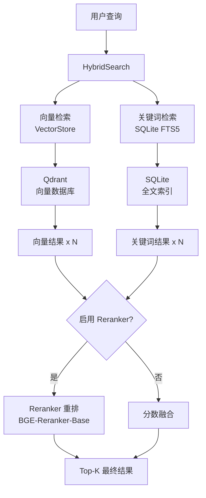

# 检索模块

**导航**: [← 返回根目录](../CLAUDE.md) / **retriever/**

> 向量检索、混合检索、Reranker 重排
>
> **最后更新**: 2025-12-08 23:06:35

## 模块概述

`retriever/` 模块提供强大的检索能力，包括：
- 向量检索（Qdrant）
- 关键词检索（SQLite FTS5）
- 混合检索（向量 + 关键词融合）
- Reranker 重排（BGE-Reranker-Base）

## 核心文件

| 文件 | 职责 | 关键类/函数 |
|------|------|------------|
| `vector_store.py` | Qdrant 向量检索 | `VectorStore` 类 |
| `hybrid_search.py` | 混合检索 + Reranker | `HybridSearch` 类 |
| `reranker.py` | Reranker 模型封装 | `get_reranker()` 工厂函数 |
| `__init__.py` | 模块初始化 | - |

## 架构设计



## 核心类

### 1. VectorStore (vector_store.py)

#### 功能
- 连接 Qdrant 向量数据库
- 执行向量相似度检索
- 管理 Collection 和 Point

#### 关键方法
```python
class VectorStore:
    def __init__(self):
        # 初始化 Qdrant 客户端和 Embedding 模型
        self.client = QdrantClient(...)
        self.embedding_model = EmbeddingModel()

    def search(
        self,
        query: str,
        top_k: int = 5,
        filters: Optional[Dict] = None,
        score_threshold: float = 0.0
    ) -> List[Dict]:
        """
        向量检索

        流程：
        1. 将查询文本编码为向量
        2. 调用 Qdrant 搜索 API
        3. 应用过滤条件和分数阈值
        4. 返回结果列表
        """

    def add_points(
        self,
        points: List[PointStruct]
    ):
        """添加向量点到 Qdrant"""

    def delete_points(
        self,
        point_ids: List[str]
    ):
        """删除向量点"""
```

### 2. HybridSearch (hybrid_search.py)

#### 功能
- 整合向量检索和关键词检索
- 结果融合和去重
- 可选的 Reranker 重排

#### 初始化
```python
class HybridSearch:
    def __init__(self):
        self.vector_store = VectorStore()
        self.db_path = BASE_DIR / "rag.db"
        self._reranker = None  # 懒加载
        self._init_keyword_index()
```

#### 关键方法
```python
def search(
    self,
    query: str,
    top_k: int = 5,
    filters: Optional[Dict] = None
) -> List[Dict]:
    """
    混合检索（向量 + 关键词 + Reranker）

    流程：
    1. 并行执行向量检索和关键词检索
    2. 如果启用 Reranker：
       a. 获取 top_k * RERANKER_TOP_K_MULTIPLIER 个候选
       b. 调用 Reranker 重排
       c. 取 Top-K
    3. 否则：
       a. 分数融合（RRF 或加权平均）
       b. 去重和排序
       c. 取 Top-K
    4. 返回结果
    """

def _vector_search(self, query: str, top_k: int, filters) -> List[Dict]:
    """调用 VectorStore 进行向量检索"""

def _keyword_search(self, query: str, top_k: int) -> List[Dict]:
    """使用 SQLite FTS5 进行关键词检索"""

def _merge_results(
    self,
    vector_results: List[Dict],
    keyword_results: List[Dict]
) -> List[Dict]:
    """融合向量和关键词检索结果"""
```

#### 关键词检索 (SQLite FTS5)
```sql
-- 创建全文索引表
CREATE VIRTUAL TABLE keyword_index_fts USING fts5(
    content,
    file_path,
    type,
    content='keyword_index',
    content_rowid='rowid'
);

-- 检索查询
SELECT * FROM keyword_index_fts
WHERE keyword_index_fts MATCH ?
ORDER BY rank
LIMIT ?;
```

### 3. Reranker (reranker.py)

#### 功能
- 封装 BGE-Reranker-Base 模型
- 对候选文档重新打分
- 提高检索精度

#### 使用方式
```python
from retriever.reranker import get_reranker

reranker = get_reranker()
scores = reranker.compute_scores(
    query="用户问题",
    documents=["文档1", "文档2", ...]
)
```

#### 模型信息
- 模型: `BAAI/bge-reranker-base`
- 输入: (query, document) 对
- 输出: 相关性分数（0-1）
- 推理速度: ~50ms/对 (CPU)

## 检索策略

### 1. 纯向量检索
```python
retriever = VectorStore()
results = retriever.search(query="问题", top_k=5)
```

**优点**: 语义相似，支持模糊匹配
**缺点**: 对专有名词和精确匹配不敏感

### 2. 纯关键词检索
```python
hybrid = HybridSearch()
results = hybrid._keyword_search(query="关键词", top_k=5)
```

**优点**: 精确匹配，快速
**缺点**: 无法理解语义

### 3. 混合检索（推荐）
```python
hybrid = HybridSearch()
results = hybrid.search(query="问题", top_k=5)
```

**优点**: 结合向量和关键词优势
**配置**:
- 向量候选数: `top_k * 2`
- 关键词候选数: `top_k * 2`
- 融合策略: RRF (Reciprocal Rank Fusion)

### 4. 混合检索 + Reranker（最佳）
```python
# 需在 .env 中设置 RERANKER_ENABLE=1
hybrid = HybridSearch()
results = hybrid.search(query="问题", top_k=5)
```

**流程**:
1. 获取 `top_k * RERANKER_TOP_K_MULTIPLIER` 个候选（默认 3 倍）
2. Reranker 重排所有候选
3. 取 Top-K 返回

**优点**: 最高精度，召回率和准确率兼顾
**缺点**: 性能开销较大（~50-150ms）

## 分数融合算法

### RRF (Reciprocal Rank Fusion)
```python
def rrf_score(rank: int, k: int = 60) -> float:
    return 1.0 / (k + rank)

# 示例：
# 向量检索：doc1 (rank=1), doc2 (rank=3)
# 关键词检索：doc1 (rank=2), doc3 (rank=1)

# doc1: 1/(60+1) + 1/(60+2) ≈ 0.0328
# doc2: 1/(60+3) ≈ 0.0159
# doc3: 1/(60+1) ≈ 0.0164
```

## 依赖关系

### 上游依赖
- `qdrant_client` - Qdrant Python 客户端
- `sentence_transformers` - Reranker 模型
- `utils.embeddings.EmbeddingModel` - 嵌入模型
- `config` - 配置参数

### 下游消费者
- `qa.chain.QAChatChain` - 问答链
- `api/server.py` - API 服务

## 环境变量

| 变量 | 说明 | 默认值 |
|------|------|--------|
| `QDRANT_HOST` | Qdrant 主机 | `localhost` |
| `QDRANT_PORT` | Qdrant 端口 | `6333` |
| `QDRANT_API_KEY` | Qdrant 认证密钥 | `None` |
| `QDRANT_USE_HTTPS` | 使用 HTTPS | `False` |
| `QDRANT_COLLECTION_NAME` | 集合名称 | `rag_knowledge` |
| `RERANKER_ENABLE` | 启用 Reranker | `1` |
| `RERANKER_MODEL` | Reranker 模型 | `BAAI/bge-reranker-base` |
| `RERANKER_TOP_K_MULTIPLIER` | 候选倍数 | `3` |

## 性能优化

### 1. 向量检索优化
- 使用 HNSW 索引（Qdrant 默认）
- 调整 `ef_construct` 和 `m` 参数
- 启用向量量化（Scalar/Product Quantization）

### 2. 关键词检索优化
- SQLite FTS5 已足够快（~1-5ms）
- 定期 `OPTIMIZE` FTS 表

### 3. Reranker 优化
- 懒加载模型（首次调用时加载）
- 批量重排（一次处理多个候选）
- 考虑使用 GPU 加速

## 常见问题

### 1. 检索结果为空？
- 检查 Qdrant Collection 是否有数据
- 检查关键词索引表是否为空
- 降低 `score_threshold`

### 2. Reranker 太慢？
- 减少 `RERANKER_TOP_K_MULTIPLIER`（如 2）
- 使用更小的 Reranker 模型
- 考虑禁用 Reranker

### 3. 检索精度不高？
- 启用 Reranker
- 调整 `top_k` 值
- 优化嵌入模型（使用领域专用模型）

## 后续改进

- [ ] 支持过滤条件（按分类、标签、时间）
- [ ] 实现检索缓存（Redis）
- [ ] 添加检索质量评估（MRR, NDCG）
- [ ] 支持多模态检索（图片、代码）
- [ ] 实现查询扩展（同义词、关键词提取）
