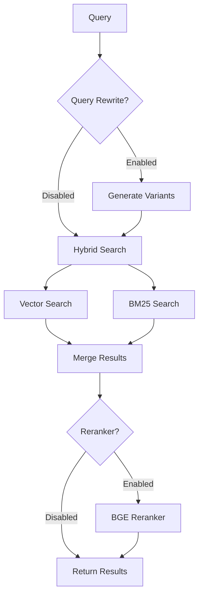

# Retriever Module

> [Home](../CLAUDE.md) > Retriever

## Overview

Hybrid search system combining vector similarity, keyword matching, query rewriting, and optional reranking.

## Key Files

| File | Description |
|------|-------------|
| `hybrid_search.py` | Main hybrid search orchestrator |
| `vector_store.py` | Qdrant vector store wrapper |
| `keyword_index.py` | BM25 keyword indexing |
| `reranker.py` | BGE reranker for result refinement |
| `query_rewriter.py` | LLM-based query expansion |
| `semantic_cache.py` | Similarity-based response caching |
| `vector_optimizer.py` | Qdrant index optimization |

## Architecture



## Hybrid Search (`hybrid_search.py`)

### Key Class: `HybridSearch`

```python
class HybridSearch:
    def search(
        self,
        query: str,
        top_k: int = 5,
        group_names: List[str] = None,
        user_id: int = None
    ) -> List[Dict]
```

### Features

- Multi-user access control via `get_user_accessible_qdrant_ids()`
- Group-based filtering
- Fusion of vector and keyword results
- Optional query rewriting (multi_query/HyDE)
- Optional reranking

## Vector Store (`vector_store.py`)

Thin wrapper around Qdrant client:

```python
class VectorStore:
    def search(self, query_vector, top_k, filter_ids=None)
    def add_documents(self, documents, vectors, metadata)
    def delete(self, ids)
```

## Semantic Cache (`semantic_cache.py`)

Caches Q&A responses based on semantic similarity:

```python
class SemanticCache:
    def get(self, question) -> Optional[str]
    def set(self, question, answer, ttl=3600)
    def invalidate(self, question)
```

## Reranker (`reranker.py`)

BGE cross-encoder for result refinement:

```python
class Reranker:
    def rerank(self, query, documents, top_k) -> List[Dict]
```

Configuration:
- `RERANKER_ENABLE`: 0/1
- `RERANKER_MODEL_NAME`: BAAI/bge-reranker-base
- `RERANKER_DEVICE`: cpu/cuda

## Query Rewriter (`query_rewriter.py`)

LLM-based query expansion:

- **multi_query**: Generate N query variants
- **HyDE**: Generate hypothetical document

## Configuration

```python
# config.py
TOP_K = 5
RERANKER_ENABLE = True
QUERY_REWRITE_ENABLE = True
QUERY_REWRITE_STRATEGY = "multi_query"
QUERY_REWRITE_NUM_VARIANTS = 3
```

## Dependencies

- Qdrant client
- BGE models (optional)
- LLM client (for rewriting)
