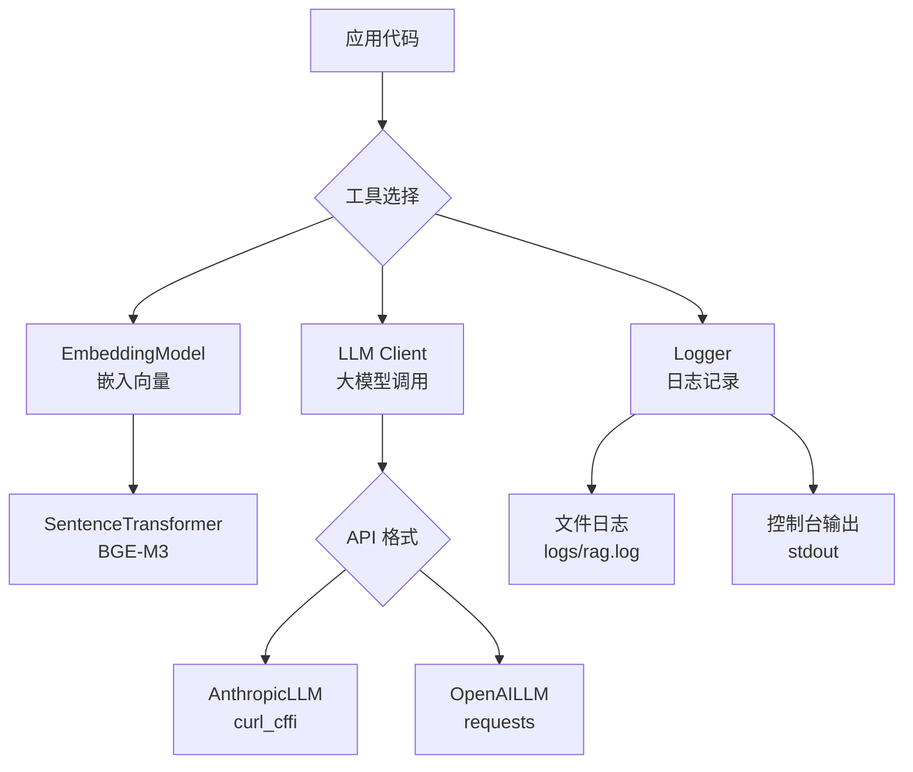

# 工具模块

**导航**: [← 返回根目录](../CLAUDE.md) / **utils/**

> 嵌入模型、LLM 客户端、日志记录等通用工具
>
> **最后更新**: 2025-12-08 23:26:20

## 模块概述

`utils/` 模块提供项目通用的工具函数和类，包括:
- 嵌入模型封装（BGE-M3）
- LLM 客户端抽象层（Anthropic/OpenAI）
- 日志管理
- 通用辅助函数

## 核心文件

| 文件 | 职责 | 关键类/函数 |
|------|------|------------|
| `embeddings.py` | 嵌入模型管理 | `EmbeddingModel` 单例类 |
| `llm.py` | LLM 客户端抽象 | `BaseLLM`, `AnthropicLLM`, `OpenAILLM`, `get_llm_client()` |
| `logger.py` | 日志配置 | `logger` 实例 |
| `__init__.py` | 模块初始化 | - |

## 架构设计



## 核心类

### 1. EmbeddingModel (embeddings.py)

#### 功能
- 加载和管理嵌入模型（单例模式）
- 文本向量化（支持批处理）
- 自动 GPU/CPU 设备选择

#### 关键方法

```python
class EmbeddingModel:
    """嵌入模型单例"""

    def __init__(self):
        # 单例初始化，自动检测设备
        device = "cuda" if torch.cuda.is_available() else "cpu"
        self._model = SentenceTransformer(EMBEDDING_MODEL, device=device)

    def encode(
        self,
        texts: Union[str, List[str]],
        batch_size: int = 32,
        show_progress_bar: bool = False
    ) -> np.ndarray:
        """
        生成嵌入向量

        Args:
            texts: 单个文本或文本列表
            batch_size: 批处理大小
            show_progress_bar: 是否显示进度条

        Returns:
            归一化后的嵌入向量 (n_texts, embedding_dim)
        """

    def get_embedding_dim(self) -> int:
        """获取嵌入维度（BGE-M3: 1024）"""
```

#### 单例模式实现

```python
# 全局唯一实例
_instance = None
_model = None

def __new__(cls):
    if cls._instance is None:
        cls._instance = super().__new__(cls)
    return cls._instance
```

**优点**: 避免重复加载模型，节省内存和初始化时间

#### 使用示例

```python
from utils.embeddings import EmbeddingModel

# 获取嵌入模型实例（首次加载）
embedding_model = EmbeddingModel()

# 单个文本
vector = embedding_model.encode("这是一段测试文本")
# shape: (1024,)

# 批量文本
vectors = embedding_model.encode([
    "文本1", "文本2", "文本3"
], batch_size=32)
# shape: (3, 1024)
```

### 2. LLM Client (llm.py)

#### 功能
- 抽象 LLM 调用接口
- 支持 Anthropic 和 OpenAI 格式 API
- 使用 `curl_cffi` 绕过 Cloudflare WAF
- 自动重试机制

#### 类层次结构

```python
BaseLLM (抽象基类)
├── AnthropicLLM (Anthropic 格式)
└── OpenAILLM (OpenAI 格式)
```

#### AnthropicLLM 类

```python
class AnthropicLLM(BaseLLM):
    """Anthropic 格式 LLM（支持第三方 API）"""

    def __init__(
        self,
        api_key: str,
        model: str,
        base_url: Optional[str] = None,
        temperature: float = 0.7,
        max_tokens: int = 4096
    ):
        self.api_key = api_key
        self.model = model
        self.base_url = base_url or "https://api.anthropic.com"
        self.temperature = temperature
        self.max_tokens = max_tokens

    def invoke(
        self,
        messages: List[Dict[str, str]],
        max_retries: int = 3
    ) -> str:
        """
        调用 Anthropic API（带重试）

        核心特性：
        1. 使用 curl_cffi 绕过 Cloudflare
        2. 随机浏览器指纹（增加成功率）
        3. 指数退避重试机制
        4. 错误消息截断（避免数据库字段溢出）
        """
```

**绕过 WAF 技术**:
- 使用 `curl_cffi` 模拟真实浏览器请求
- 随机选择浏览器指纹（chrome120, safari15_5 等）
- 设置完整的浏览器请求头

#### OpenAILLM 类

```python
class OpenAILLM(BaseLLM):
    """OpenAI 格式 LLM"""

    def invoke(
        self,
        messages: List[Dict[str, str]]
    ) -> str:
        """调用 OpenAI 兼容 API"""
```

#### 工厂函数

```python
def get_llm_client() -> BaseLLM:
    """
    根据环境变量获取 LLM 客户端

    读取配置：
    - LLM_PROVIDER: "anthropic" 或 "openai"
    - LLM_MODEL: 模型名称
    - ANTHROPIC_API_KEY / OPENAI_API_KEY
    - ANTHROPIC_API_BASE / OPENAI_API_BASE（可选）

    Returns:
        AnthropicLLM 或 OpenAILLM 实例
    """
```

#### 使用示例

```python
from utils.llm import get_llm_client

# 自动根据配置初始化
llm = get_llm_client()

# 调用 LLM
messages = [
    {"role": "user", "content": "你好"}
]
response = llm.invoke(messages)
print(response)  # "你好！有什么我可以帮助你的吗？"
```

### 3. Logger (logger.py)

#### 功能
- 统一日志配置
- 文件和控制台双输出
- 日志级别控制

#### 配置

```python
import logging

# 创建 logger
logger = logging.getLogger("rag")
logger.setLevel(logging.INFO)

# 文件处理器
file_handler = logging.FileHandler("logs/rag.log")
file_handler.setFormatter(
    logging.Formatter(
        "%(asctime)s - %(name)s - %(levelname)s - %(message)s"
    )
)

# 控制台处理器
console_handler = logging.StreamHandler()
console_handler.setFormatter(
    logging.Formatter("%(levelname)s - %(message)s")
)

logger.addHandler(file_handler)
logger.addHandler(console_handler)
```

#### 使用示例

```python
from utils.logger import logger

logger.info("服务启动成功")
logger.warning("检测到潜在问题")
logger.error("操作失败", exc_info=True)
```

## 依赖关系

### 上游依赖
- `sentence-transformers` - 嵌入模型
- `torch` - PyTorch 框架
- `curl_cffi` - 绕过 Cloudflare
- `requests` - HTTP 客户端（备用）

### 下游消费者
- `retriever/` - 向量检索
- `indexer/` - 数据索引
- `qa/` - 问答链
- `api/` - API 服务
- 所有其他模块

## 环境变量

| 变量 | 说明 | 默认值 |
|------|------|--------|
| `EMBEDDING_MODEL` | 嵌入模型名称 | `BAAI/bge-m3` |
| `EMBEDDING_DEVICE` | 设备选择 | `cpu` |
| `LLM_PROVIDER` | LLM 提供商 | `anthropic` |
| `LLM_MODEL` | 模型名称 | `claude-3-5-haiku-20241022` |
| `ANTHROPIC_API_KEY` | Anthropic API Key | - |
| `ANTHROPIC_API_BASE` | 自定义 API 地址 | 官方地址 |
| `OPENAI_API_KEY` | OpenAI API Key | - |
| `OPENAI_API_BASE` | 自定义 API 地址 | 官方地址 |

## 性能优化

### 嵌入模型优化
1. **单例模式**: 避免重复加载模型
2. **批处理**: `encode()` 支持批量文本
3. **GPU 加速**: 自动检测并使用 CUDA
4. **归一化**: 自动进行向量归一化

### LLM 调用优化
1. **连接复用**: 使用 `requests.Session`
2. **超时控制**: 设置合理的超时时间
3. **重试机制**: 指数退避重试
4. **错误截断**: 防止超长错误消息

## 常见问题

### 1. 嵌入模型加载慢？
首次加载需要下载模型文件（~2GB）。后续启动会从缓存加载（~5秒）。

**解决方案**:
```bash
# 预先下载模型
python -c "from sentence_transformers import SentenceTransformer; SentenceTransformer('BAAI/bge-m3')"
```

### 2. LLM 调用被 WAF 拦截？
- 确保安装 `curl_cffi`: `pip install curl_cffi`
- 检查 API Base URL 是否正确
- 尝试更换浏览器指纹

### 3. 日志文件过大？
实现日志轮转：
```python
from logging.handlers import RotatingFileHandler

file_handler = RotatingFileHandler(
    "logs/rag.log",
    maxBytes=10*1024*1024,  # 10MB
    backupCount=5
)
```

## 后续改进

- [ ] 支持更多嵌入模型（OpenAI Embeddings, Cohere）
- [ ] LLM 调用支持流式输出
- [ ] 添加 LLM 调用缓存机制
- [ ] 实现异步 LLM 调用
- [ ] 日志支持结构化输出（JSON）
- [ ] 添加性能监控指标
